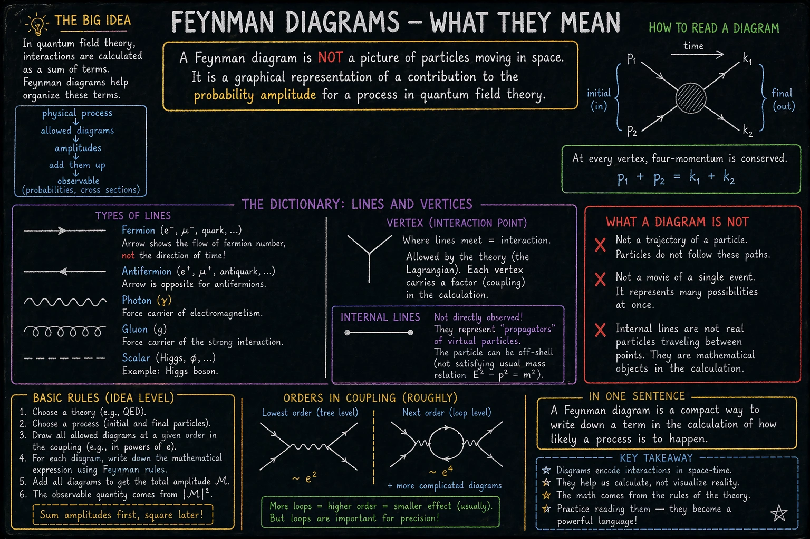
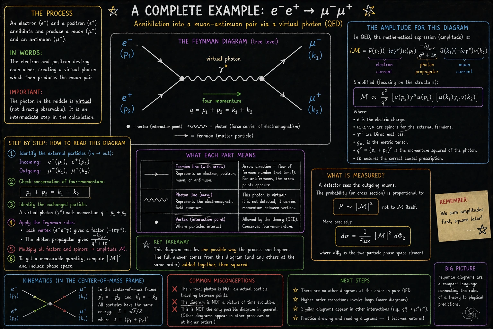
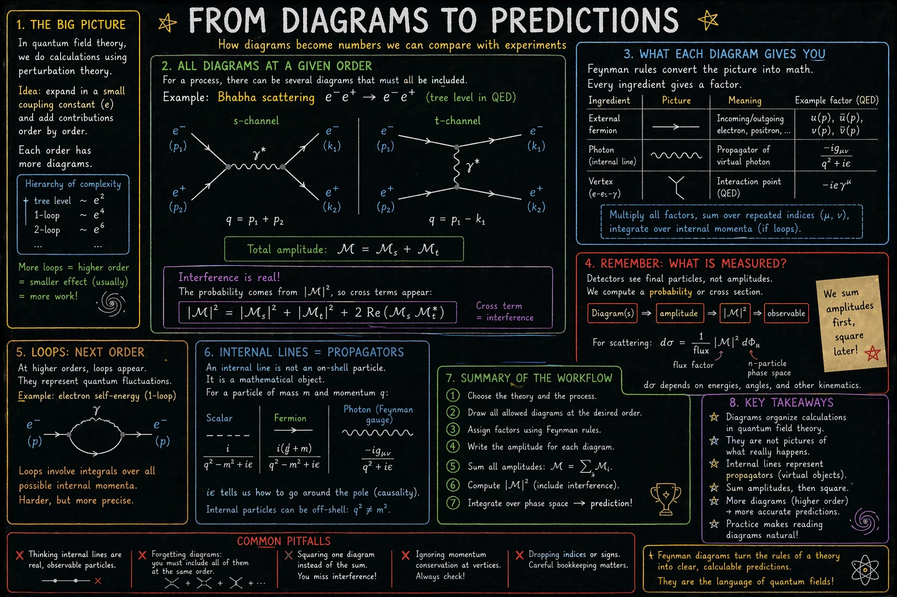
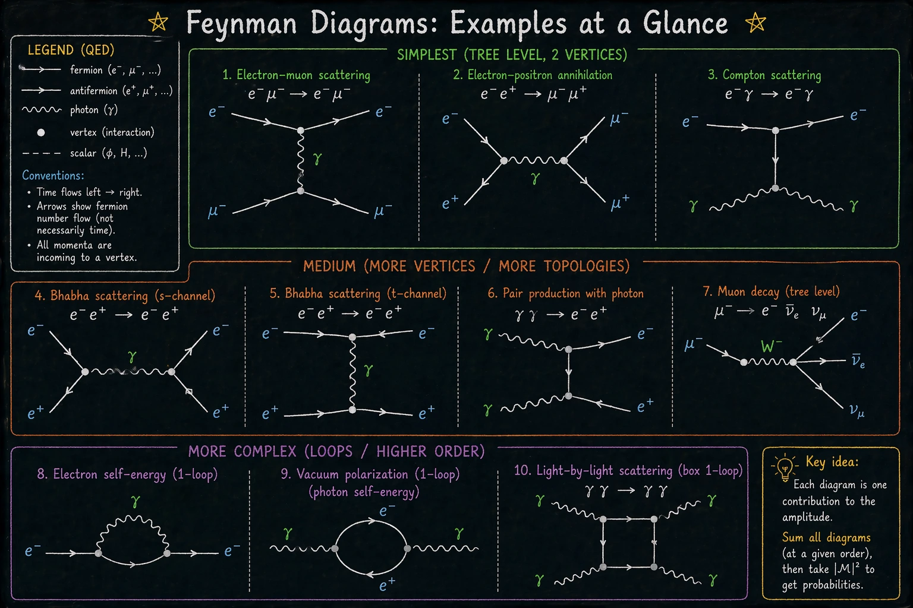

Diagramy Feynmana są jednym z najbardziej rozpoznawalnych języków fizyki cząstek. Wyglądają jak rysunki torów cząstek, ale taka intuicja jest myląca. Diagram nie jest filmem z pojedynczego zdarzenia. Jest graficznym zapisem jednego składnika amplitudy przejścia w perturbacyjnym rachunku kwantowej teorii pola.

Poniżej są cztery plansze: trzy wprowadzające i jedna dodatkowa z przykładami. Razem tworzą krótki starter: najpierw sens diagramu, potem jeden pełny przykład, następnie przejście od rysunku do wielkości mierzalnych.

## 1. Co naprawdę pokazuje diagram Feynmana

<figure class="infographic-figure">
  
  <figcaption>Podstawowa legenda diagramów Feynmana obejmuje linie zewnętrzne, linie wewnętrzne, wierzchołki, zachowanie czteropędu i typowe błędne interpretacje.</figcaption>
</figure>

Najważniejsze zdanie brzmi: diagram Feynmana nie jest zdjęciem torów cząstek. Linie nie pokazują dosłownych ścieżek w przestrzeni, a linie wewnętrzne nie oznaczają obserwowalnych cząstek lecących między dwoma punktami.

Diagram porządkuje składnik rachunku. Teoria pola mówi, jakie pola istnieją i jakie sprzężenia są dozwolone. Reguły Feynmana zamieniają rysunek na wyrażenie matematyczne. Linie zewnętrzne odpowiadają stanom wejściowym i wyjściowym procesu, wierzchołki oznaczają lokalne oddziaływania pól dozwolone przez lagrangian teorii, a linie wewnętrzne są propagatorami.

Warto też uważać na strzałki. Strzałka na linii fermionowej nie musi oznaczać kierunku ruchu cząstki w czasie. Oznacza orientację linii fermionowej, związaną z przepływem liczby fermionowej i z konwencją używaną w rachunku. Dla antycząstek strzałka może być przeciwna do intuicyjnie rozumianego kierunku ruchu.

## 2. Pełny przykład: e⁻ e⁺ → μ⁻ μ⁺

<figure class="infographic-figure">
  
  <figcaption>Najprostszy obraz procesu e⁻ e⁺ → μ⁻ μ⁺ w czystej QED: wymiana wirtualnego fotonu, bez wkładu bozonu Z.</figcaption>
</figure>

Dobrym pierwszym przykładem jest proces e⁻ e⁺ → μ⁻ μ⁺.

W najprostszym przybliżeniu QED elektron i pozyton są stanami początkowymi, a mion i antymion stanami końcowymi. Najniższy wkład perturbacyjny zawiera dwie linie fermionowe i wewnętrzną linię fotonową. Tę wewnętrzną linię opisuje propagator wirtualnego fotonu o czteropędzie q = p₁ + p₂ = k₁ + k₂.

Ten foton jest wirtualny. Nie jest produktem końcowym widzianym przez detektor i nie należy wyobrażać go sobie jako zwykłego fotonu lecącego przez przestrzeń. Jest elementem amplitudy. Może mieć czteropęd niespełniający relacji masowej swobodnego fotonu, czyli w ogólności nie musi mieć q² = 0.

Trzeba też pamiętać o zakresie przybliżenia. W czystej QED na poziomie drzewa opisujemy ten proces przez wymianę wirtualnego fotonu. W pełnej teorii elektrosłabej Modelu Standardowego możliwy jest także wkład z bozonem Z⁰, szczególnie ważny przy energiach zbliżonych do masy Z. Na tej planszy świadomie pokazany jest najprostszy wkład QED.

Sam diagram daje amplitudę 𝓜, nie bezpośrednio prawdopodobieństwo. Dopiero po obliczeniu |𝓜|², uwzględnieniu kinematyki, spinów, normalizacji, strumienia cząstek początkowych i przestrzeni fazowej otrzymuje się wielkości porównywalne z eksperymentem, na przykład przekrój czynny albo rozkład kątowy.

## 3. Od diagramu do predykcji

<figure class="infographic-figure">
  
  <figcaption>Workflow rachunkowy: teoria i reguły Feynmana prowadzą do dozwolonych diagramów, amplitudy, modułu kwadratowego i wielkości mierzalnych.</figcaption>
</figure>

W praktyce wybiera się teorię, proces oraz rząd rachunku perturbacyjnego. Następnie rysuje się wszystkie diagramy dopuszczalne na tym rzędzie, przypisuje czynniki liniom, wierzchołkom i stanom zewnętrznym, pilnuje zachowania czteropędu oraz wykonuje wymagane sumowania po indeksach, spinach i polaryzacjach.

Kluczowy punkt jest prosty: najpierw sumuje się amplitudy, a dopiero potem liczy moduł kwadratowy. Dwa diagramy nie są więc po prostu dwoma niezależnymi obrazkami dającymi osobne prawdopodobieństwa. Ich amplitudy mogą interferować.

Schemat wygląda następująco: 𝓜 = 𝓜₁ + 𝓜₂ + …, a wielkość mierzalna zależy od |𝓜|². Dlatego w wyrażeniu pojawiają się nie tylko składniki typu |𝓜₁|² i |𝓜₂|², ale także wyrazy mieszane, czyli interferencja.

Pętle oznaczają poprawki wyższego rzędu. Wnoszą całki po pędach wewnętrznych i prowadzą do subtelniejszych tematów, takich jak renormalizacja, poprawki radiacyjne czy bieganie stałych sprzężenia. Nie są dekoracją rysunku, tylko kolejnymi składnikami rachunku.

## 4. Przykłady diagramów na jednym arkuszu

<figure class="infographic-figure">
  
  <figcaption>Zestaw przykładów: proste diagramy na poziomie drzewa, kilka średnich topologii oraz przykłady z pętlami i wyższym rzędem rachunku.</figcaption>
</figure>

Ostatnia plansza jest szybkim atlasem przykładów. Na górze są proste procesy na poziomie drzewa, między innymi rozpraszanie elektron-mion, anihilacja elektron-pozyton i rozpraszanie Comptona. W środku pojawiają się przykłady z większą liczbą topologii albo z innym nośnikiem oddziaływania. Na dole są poprawki pętlowe, takie jak samoenergia elektronu, polaryzacja próżni i rozpraszanie światło-światło przez diagram pudełkowy.

Ten arkusz należy czytać jako orientacyjny przegląd, nie jako kompletny katalog wszystkich diagramów dla każdego procesu. W pełnej QED niektóre procesy, takie jak rozpraszanie Comptona e⁻ γ → e⁻ γ albo produkcja pary γγ → e⁻ e⁺, mają na najniższym rzędzie więcej niż jeden diagram. Różne diagramy odpowiadają różnym kolejnościom przyłączenia fotonów do linii fermionowej i wszystkie trzeba uwzględnić w amplitudzie.

Plansza pokazuje też przykład spoza czystej QED: rozpad mionu przez bozon W⁻. To już oddziaływanie słabe, ale reguła interpretacyjna pozostaje podobna: linie i wierzchołki nie są filmem z mikroświata, tylko zapisem składników rachunku wynikających z danej teorii.

Wspólna zasada pozostaje ta sama: każdy dopuszczalny diagram jest wkładem do amplitudy, a wynik fizyczny wymaga poprawnego zsumowania wszystkich wkładów w wybranym przybliżeniu. Dopiero potem przechodzi się do |𝓜|², przestrzeni fazowej i wielkości mierzalnych.

---

Infografiki zostały wygenerowane przy użyciu modelu [gpt-image-2](https://developers.openai.com/api/docs/models/gpt-image-2).
