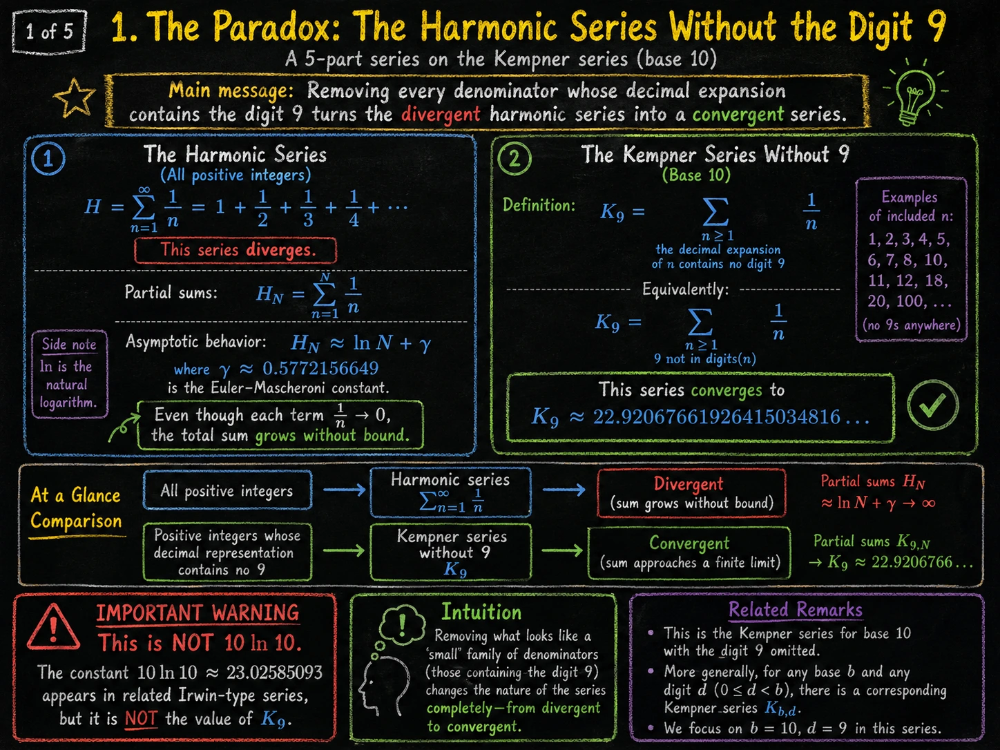
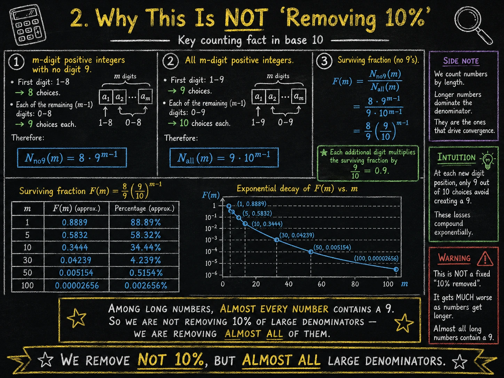
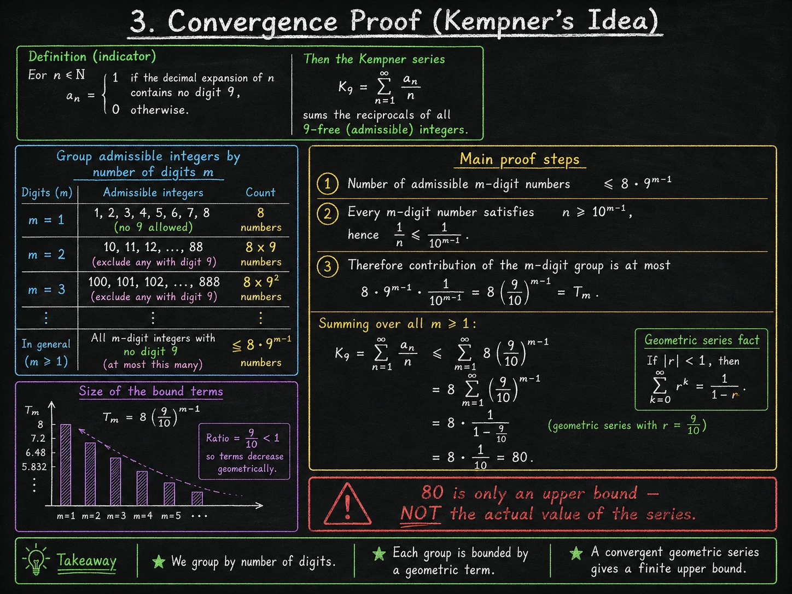
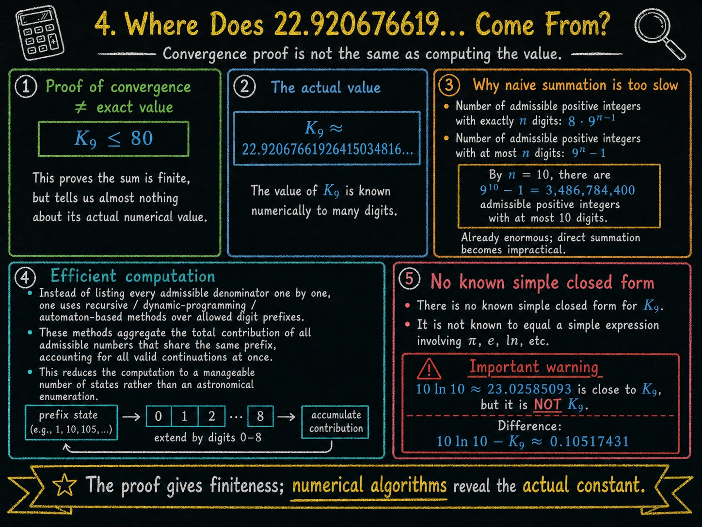
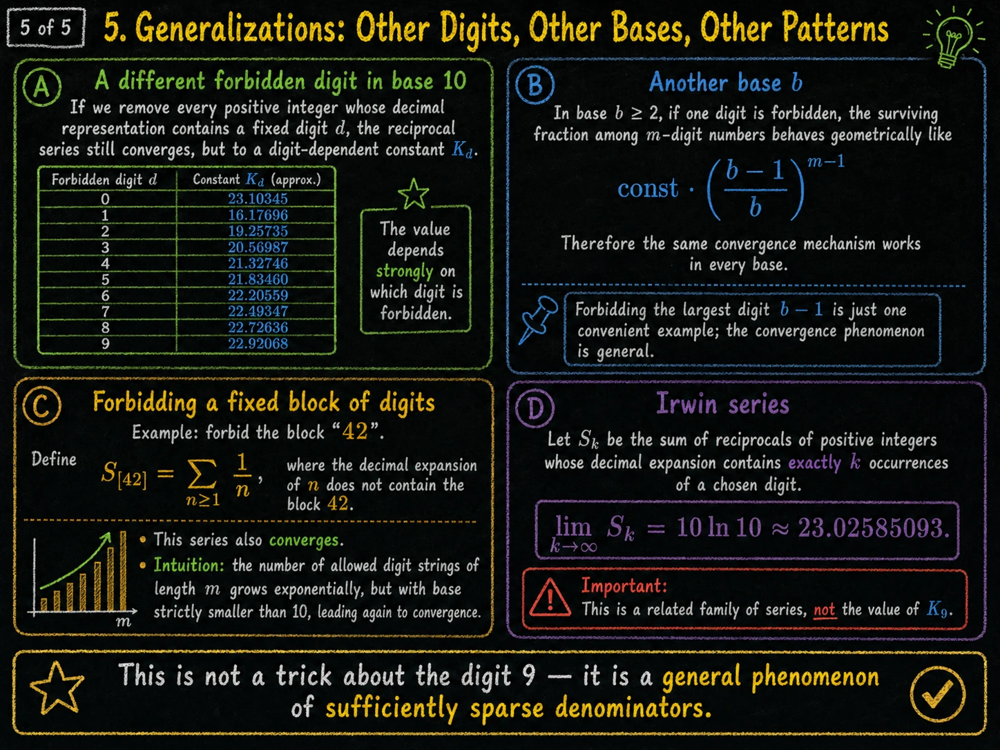

Szereg harmoniczny jest jednym z najprostszych szeregów nieskończonych:

1 + ½ + ⅓ + ¼ + …

Mimo że jego wyrazy maleją do zera, suma rośnie bez ograniczeń. Co zaskakujące, wystarczy usunąć z niego wszystkie składniki, których mianownik zawiera cyfrę 9, aby otrzymać szereg zbieżny. Ten obiekt nazywa się szeregiem Kempnera. Zwykle zapisuje się go jako sumę odwrotności tych liczb naturalnych, których zapis dziesiętny nie zawiera dziewiątki. Klasyczny przypadek ma wartość około 22.920676619264150…, choć prosty dowód zbieżności daje tylko bardzo luźne ograniczenie z góry.

Poniższe pięć plansz pokazuje ten paradoks krok po kroku. Najpierw porównujemy zwykły szereg harmoniczny z jego „przerzedzoną” wersją. Następnie liczymy, ile liczb naprawdę zostaje po zakazaniu cyfry 9. Potem pojawia się właściwy dowód zbieżności: grupowanie składników według liczby cyfr i sprowadzenie problemu do szeregu geometrycznego. Dwie ostatnie plansze wyjaśniają, skąd bierze się wartość numeryczna oraz dlaczego to zjawisko nie jest sztuczką z jedną konkretną cyfrą.

## 1. Paradoks: szereg harmoniczny bez cyfry 9

<figure class="infographic-figure">
  
  <figcaption>Pierwsza plansza zestawia rozbieżny szereg harmoniczny z szeregiem Kempnera, czyli szeregiem po mianownikach bez cyfry 9.</figcaption>
</figure>

Zwykły szereg harmoniczny sumuje odwrotności wszystkich liczb naturalnych. Jest rozbieżny, choć rośnie bardzo wolno: jego sumy częściowe zachowują się asymptotycznie jak H_N ≈ ln N + γ. To znaczy, że nawet bardzo daleko w szeregu dodajemy już małe składniki, ale ich łączny efekt nadal narasta bez ograniczeń. Właśnie dlatego szereg harmoniczny jest klasycznym przykładem subtelnej rozbieżności.

Po prawej stronie planszy pojawia się jego wersja z ograniczeniem: sumujemy tylko te 1/n, dla których zapis dziesiętny n nie zawiera cyfry 9. To jest szereg Kempnera K₉. Zaskoczenie polega na tym, że usunięcie pozornie niewielkiej klasy mianowników zmienia charakter całego szeregu. Zamiast sumy rosnącej do nieskończoności dostajemy skończoną stałą:

K₉ ≈ 22.92067661926415034816…

Plansza celowo zaznacza też, że ta liczba nie jest równa 10 ln 10. Stała 10 ln 10 pojawia się w pokrewnych seriach Irwina, ale nie jest wartością szeregu Kempnera.

## 2. Dlaczego to nie jest „usunięcie 10%”

<figure class="infographic-figure">
  
  <figcaption>Druga plansza wyjaśnia kluczowy fakt kombinatoryczny: wśród długich liczb prawie każda zawiera cyfrę 9.</figcaption>
</figure>

Pierwsza fałszywa intuicja jest taka: skoro zakazujemy jednej cyfry z dziesięciu, to usuwamy około 10% liczb. To byłoby prawdą tylko wtedy, gdyby każda liczba miała jedną cyfrę. Dla liczb wielocyfrowych sytuacja zmienia się radykalnie, bo każda kolejna pozycja daje nową szansę na pojawienie się dziewiątki.

Plansza liczy liczby m-cyfrowe bez cyfry 9. Pierwsza cyfra może być jedną z cyfr 1, …, 8, więc mamy 8 możliwości. Każda kolejna cyfra może być jedną z cyfr 0, …, 8, więc daje 9 możliwości. Dlatego liczba m-cyfrowych liczb bez 9 wynosi:

8 · 9ᵐ⁻¹

Wszystkich m-cyfrowych dodatnich liczb jest natomiast:

9 · 10ᵐ⁻¹

Ułamek liczb, które „przeżywają”, wynosi więc:

F(m) = (8/9) · (9/10)ᵐ⁻¹

Każda dodatkowa cyfra mnoży ten ułamek przez 0.9. Dla 100 cyfr zostaje już tylko około 0.002656% liczb. To nie jest stałe usunięcie 10% — wśród dużych mianowników usuwamy prawie wszystko.

## 3. Dowód zbieżności: pomysł Kempnera

<figure class="infographic-figure">
  
  <figcaption>Trzecia plansza pokazuje właściwy dowód: grupujemy mianowniki według liczby cyfr i ograniczamy wkład każdej grupy szeregiem geometrycznym.</figcaption>
</figure>

Dowód Kempnera nie wymaga znajomości dokładnej wartości sumy. Wystarczy pokazać, że cała suma jest mniejsza od pewnej skończonej liczby. Pomysł polega na podziale mianowników na grupy: liczby jednocyfrowe, dwucyfrowe, trzycyfrowe i tak dalej.

Dla liczb m-cyfrowych bez cyfry 9 mamy najwyżej 8 · 9ᵐ⁻¹ dopuszczalnych mianowników. Każda m-cyfrowa liczba spełnia n ≥ 10ᵐ⁻¹, więc jej odwrotność spełnia 1/n ≤ 1/10ᵐ⁻¹.

Wkład całej grupy m-cyfrowej jest więc nie większy niż:

8 · 9ᵐ⁻¹ · 1/10ᵐ⁻¹ = 8 · (9/10)ᵐ⁻¹

Po zsumowaniu po wszystkich długościach dostajemy szereg geometryczny:

K₉ ≤ 8 · ∑(9/10)ᵐ⁻¹ = 80

Liczba 80 nie jest wartością szeregu. Jest tylko górnym ograniczeniem, ale wystarcza, aby udowodnić zbieżność.

## 4. Skąd bierze się liczba 22.920676619…?

<figure class="infographic-figure">
  
  <figcaption>Czwarta plansza oddziela dowód zbieżności od obliczenia rzeczywistej wartości stałej Kempnera.</figcaption>
</figure>

Dowód z poprzedniej planszy mówi tylko, że K₉ ≤ 80. To wystarcza do zbieżności, ale jest bardzo słabym przybliżeniem. Rzeczywista wartość szeregu jest dużo mniejsza:

K₉ ≈ 22.92067661926415034816…

Żeby ją obliczyć, nie wystarczy prosto wypisywać wszystkich liczb bez cyfry 9 i dodawać ich odwrotności. Takie sumowanie jest poprawne teoretycznie, ale praktycznie bardzo wolne. Liczb n-cyfrowych bez 9 jest 8 · 9ⁿ⁻¹, a liczb bez 9 o długości co najwyżej n jest 9ⁿ − 1. Już dla n = 10 daje to:

9¹⁰ − 1 = 3 486 784 400

dopuszczalnych mianowników.

Dlatego do obliczeń używa się metod rekurencyjnych, dynamicznych lub automatowych, które grupują wkłady liczb o wspólnych prefiksach. Nie analizują one każdego mianownika całkowicie osobno, lecz wykorzystują strukturę zapisu dziesiętnego. To pozwala obliczyć stałą Kempnera z dużą dokładnością mimo bardzo wolnej zbieżności naiwnej sumy.

Warto też podkreślić: nie znamy prostej zamkniętej postaci tej liczby. Nie wiadomo, czy da się ją wyrazić prostym wzorem z użyciem π, e, logarytmów lub innych standardowych stałych.

## 5. Uogólnienia: inne cyfry, inne bazy, inne wzorce

<figure class="infographic-figure">
  
  <figcaption>Piąta plansza pokazuje, że zjawisko nie zależy od samej cyfry 9. To ogólny efekt rzadkich mianowników.</figcaption>
</figure>

Szereg Kempnera bez dziewiątek jest tylko jednym przypadkiem większej rodziny problemów. Można zakazać dowolnej cyfry d w bazie 10 i otrzymać zbieżny szereg odwrotności. Wartość końcowa zależy jednak od tego, którą cyfrę usuwamy. Dla cyfry 9 jest to około 22.92068, ale dla cyfry 1 wartość jest znacznie mniejsza, około 16.17696. Dla cyfry 0 wartość jest z kolei większa i wynosi około 23.10345.

Ten sam mechanizm działa również w innych bazach. Jeśli w bazie b zakazujemy jednej cyfry, to udział ocalałych liczb m-cyfrowych zachowuje się geometrycznie, z czynnikiem podobnym do ((b − 1)/b)ᵐ⁻¹.

Można też zakazywać całych bloków cyfr, na przykład „42”. Wtedy liczba dozwolonych napisów cyfrowych nadal rośnie wykładniczo, ale z podstawą mniejszą niż pełna baza, co ponownie prowadzi do zbieżności.

Ostatni panel wspomina serie Irwina. Tam nie zakazujemy cyfry całkowicie, lecz sumujemy odwrotności liczb mających dokładnie k wystąpień danej cyfry. Na przykład dla cyfry 9 i k = 2 bierzemy liczby takie jak 99, 1909 albo 29090, ale nie bierzemy 19, bo ma tylko jedną dziewiątkę, ani 999, bo ma trzy. Dla dużego k odpowiednie sumy dążą do:

10 ln 10 ≈ 23.02585093

To piękny wynik pokrewny, ale nie należy go mylić z wartością K₉.

---

Dane liczbowe i klasyczny szkic dowodu: [Kempner series](https://en.wikipedia.org/wiki/Kempner_series). Infografiki zostały wygenerowane przy użyciu modelu [gpt-image-2](https://developers.openai.com/api/docs/models/gpt-image-2).
