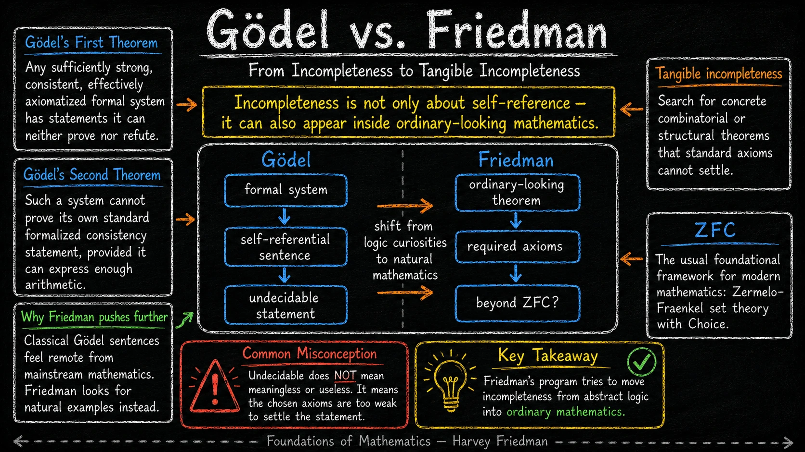
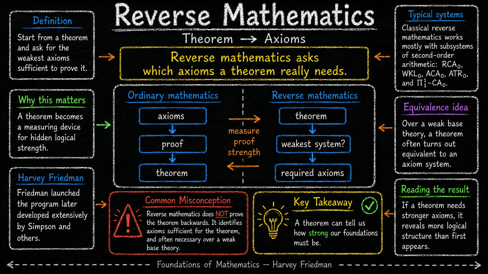
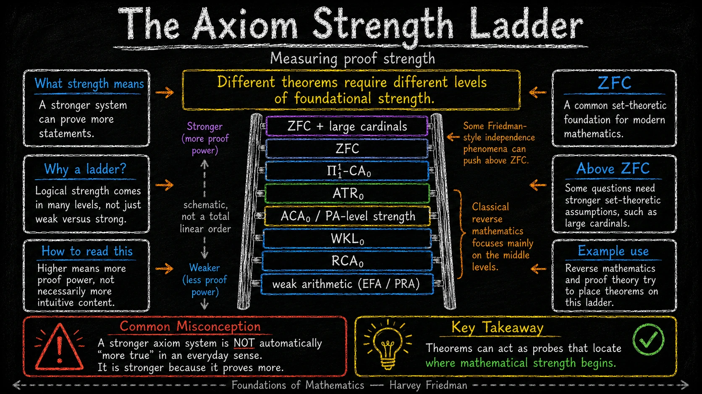
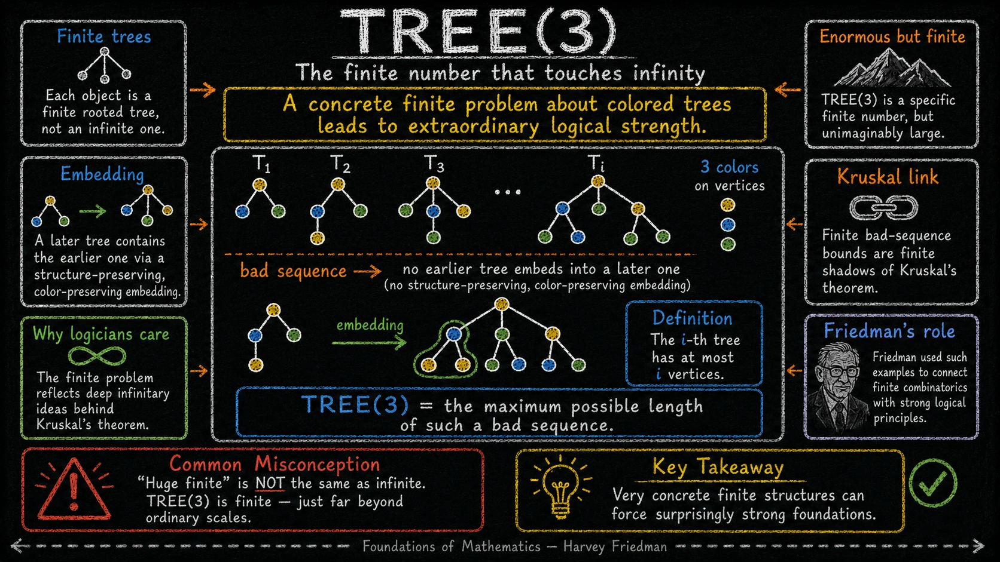
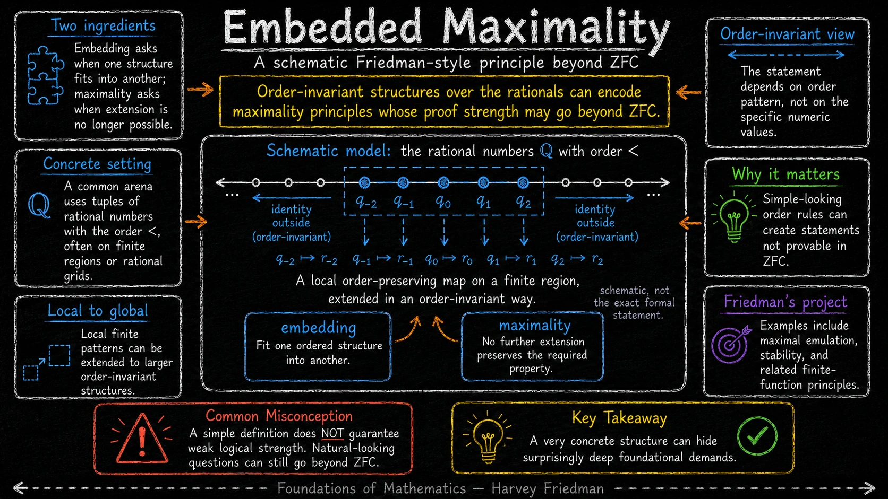
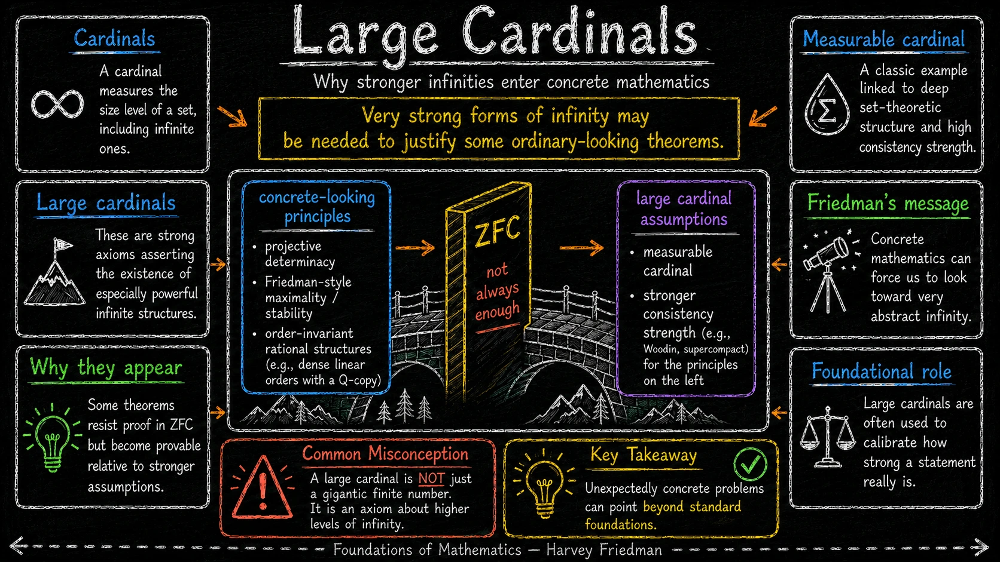
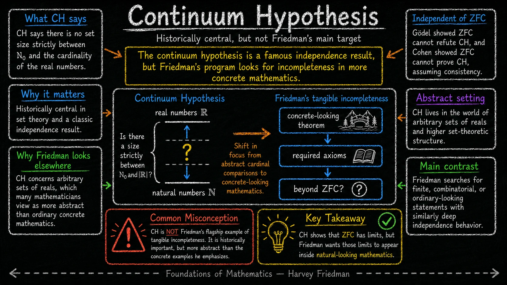
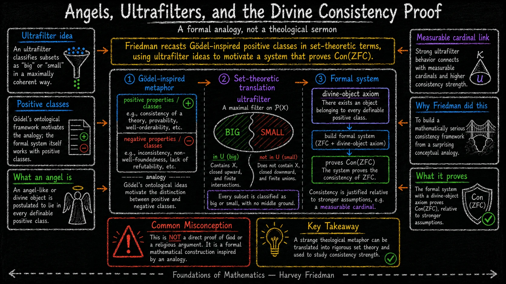

Zwykły obraz matematyki jest jednokierunkowy: wybieramy aksjomaty, budujemy teorię i dowodzimy twierdzeń. Matematyka odwrotna odwraca pytanie. Zaczyna od konkretnego twierdzenia i pyta: jak silnych aksjomatów naprawdę potrzeba, żeby je udowodnić?

To brzmi jak techniczna gra logiczna, ale prowadzi do bardzo konkretnej intuicji. Twierdzenie może działać jak przyrząd pomiarowy. Nie mówi tylko, że pewien fakt jest prawdziwy. Mówi także, gdzie na skali siły dowodowej zaczyna się matematyka potrzebna do jego uzasadnienia.

Poniższe osiem plansz prowadzi przez tę ideę: od twierdzeń Gödla, przez klasyczną matematykę odwrotną i drabinę siły aksjomatów, aż do programu Harveya Friedmana, w którym skończone lub zwyczajnie wyglądające problemy mogą dotykać aksjomatów silniejszych niż ZFC.

## 1. Od Gödla do Friedmana

<figure class="infographic-figure">
  
  <figcaption>Pierwsza plansza pokazuje przejście od abstrakcyjnej niezupełności formalnych systemów do poszukiwania niezupełności w zwyczajnie wyglądającej matematyce.</figcaption>
</figure>

Pierwsze twierdzenie Gödla mówi, że każdy dostatecznie silny, spójny i efektywnie aksjomatyzowany system formalny ma zdania, których nie potrafi ani udowodnić, ani obalić. Drugie twierdzenie Gödla mówi, że taki system nie może, w standardowy sposób, udowodnić własnej spójności.

To są wyniki fundamentalne, ale klasyczne zdania gödlowskie wyglądają z punktu widzenia wielu matematyków dość sztucznie: są zbudowane tak, żeby mówić o własnej niedowodliwości. Friedman przesuwa akcent. Interesują go przykłady, w których problem nie wygląda jak samoświadoma sztuczka logiczna, lecz jak naturalne pytanie kombinatoryczne, porządkowe albo strukturalne.

W tym sensie plansza mówi o „namacalnej niezupełności”. Nie chodzi o to, że zdanie niezależne jest bez znaczenia. Chodzi o to, że wybrany system aksjomatów może być za słaby, aby rozstrzygnąć twierdzenie, które wygląda jak część zwykłej matematyki.

## 2. Czym jest matematyka odwrotna

<figure class="infographic-figure">
  
  <figcaption>Matematyka odwrotna traktuje twierdzenie jako test: jakie aksjomaty są wystarczające, a często także konieczne, aby je udowodnić?</figcaption>
</figure>

W zwykłym kierunku dowodzenia zaczynamy od aksjomatów, przechodzimy przez dowód i dostajemy twierdzenie. Matematyka odwrotna zaczyna od twierdzenia i pyta, jaki system aksjomatów jest do niego potrzebny.

Typowy wynik ma postać równoważności nad słabą teorią bazową. Najpierw pokazuje się, że pewien system S wystarcza do udowodnienia twierdzenia T. Potem pokazuje się w drugą stronę, że samo T pozwala odzyskać S, przynajmniej nad ustaloną słabą bazą. Wtedy T i S mają tę samą siłę dowodową w tym kontekście.

Klasyczna matematyka odwrotna często pracuje w podsystemach arytmetyki drugiego rzędu, takich jak RCA₀, WKL₀, ACA₀, ATR₀ oraz Π¹₁-CA₀. Nazwy są techniczne, ale rola jest intuicyjna: tworzą skalę, na której można umieszczać twierdzenia.

Ważne zastrzeżenie z planszy: matematyka odwrotna nie dowodzi twierdzenia „od tyłu”. Ona identyfikuje, które aksjomaty są odpowiedzialne za jego dowód.

## 3. Drabina siły aksjomatów

<figure class="infographic-figure">
  
  <figcaption>Drabina jest schematyczna: wyżej oznacza większą siłę dowodową, niekoniecznie większą intuicyjność albo większą prawdziwość w potocznym sensie.</figcaption>
</figure>

Silniejszy system aksjomatów może udowodnić więcej zdań. To nie znaczy, że jest „bardziej prawdziwy” w prostym, codziennym sensie. Oznacza, że zawiera mocniejsze założenia i ma większy zasięg dowodowy.

Na dole drabiny są bardzo słabe fragmenty arytmetyki. Wyżej pojawiają się klasyczne systemy matematyki odwrotnej. Jeszcze wyżej jest ZFC, czyli standardowy język teorii mnogości używany jako fundament znacznej części współczesnej matematyki. Nad ZFC zaczynają się założenia o dużych kardynałach, czyli aksjomaty mówiące o szczególnie silnych poziomach nieskończoności.

Plansza słusznie podkreśla, że to nie jest dosłownie całkowity porządek wszystkich możliwych systemów. W praktyce hierarchia bywa rozgałęziona, a porównywanie systemów może być subtelne. Mimo to obraz drabiny dobrze oddaje zasadniczą intuicję: różne twierdzenia zaczynają wymagać różnych poziomów siły.

## 4. TREE(3): skończona liczba, która dotyka nieskończoności

<figure class="infographic-figure">
  
  <figcaption>TREE(3) jest przykładem skończonego obiektu, którego sens wyrasta z bardzo silnych zasad porządkujących drzewa skończone.</figcaption>
</figure>

TREE(3) dotyczy skończonych drzew z wierzchołkami pokolorowanymi trzema kolorami. Rozważamy sekwencję takich drzew T₁, T₂, T₃, ... z ograniczeniem, że i-te drzewo ma co najwyżej i wierzchołków. Sekwencja jest „zła”, jeśli żadne wcześniejsze drzewo nie osadza się w późniejszym w sposób zachowujący strukturę i kolory.

TREE(3) to maksymalna możliwa długość takiej złej sekwencji. Ta liczba jest skończona, ale niewyobrażalnie duża. Nie jest „nieskończona w przebraniu”: nadal jest konkretną liczbą naturalną. Jej znaczenie polega na tym, że skończony problem jest cieniem głębszych twierdzeń o dobrym uporządkowaniu, takich jak twierdzenie Kruskala o drzewach.

To dobry przykład ostrzeżenia przed zbyt prostą intuicją. „Skończone” nie znaczy automatycznie „słabe logicznie”. Bardzo konkretne struktury skończone mogą wymuszać zaskakująco silne podstawy.

## 5. Embedded maximality: lokalne wzorce i globalne zasady

<figure class="infographic-figure">
  
  <figcaption>Plansza pokazuje schematyczną intuicję: proste lokalne reguły osadzania i maksymalności mogą prowadzić do bardzo wysokiej siły dowodowej.</figcaption>
</figure>

Ta plansza jest bardziej orientacyjna niż definicyjna. Pokazuje rodzinę idei typowych dla programu Friedmana: bierzemy bardzo regularne struktury, na przykład uporządkowane układy nad liczbami wymiernymi, i badamy reguły osadzania oraz maksymalności.

Osadzanie pyta, kiedy jedna struktura mieści się w drugiej z zachowaniem właściwego wzorca. Maksymalność pyta, kiedy dalsze rozszerzanie struktury nie jest już możliwe bez złamania wymaganej własności. Jeśli dodatkowo żądamy niezmienniczości porządkowej, to nie interesują nas konkretne wartości liczbowe, tylko ich wzór uporządkowania.

Morał jest podobny jak przy TREE(3), ale przesunięty w stronę bardziej abstrakcyjnych struktur porządkowych: prosta definicja nie gwarantuje małej siły logicznej. Naturalnie wyglądające pytanie może ukrywać wymagania wykraczające poza standardowe fundamenty.

## 6. Duże kardynały: gdy ZFC nie wystarcza

<figure class="infographic-figure">
  
  <figcaption>Duże kardynały są mocnymi założeniami o nieskończoności; w programie Friedmana bywają używane do kalibracji siły zwyczajnie wyglądających twierdzeń.</figcaption>
</figure>

Kardynał mierzy rozmiar zbioru, także zbioru nieskończonego. Duże kardynały to aksjomaty mówiące, że istnieją szczególnie potężne poziomy nieskończoności. Nie chodzi o jedną ogromną liczbę skończoną, tylko o jakościowo mocniejsze założenia o strukturze uniwersum zbiorów.

Dlaczego takie obiekty miałyby pojawiać się przy problemach wyglądających konkretnie? Właśnie to jest jeden z najmocniejszych punktów programu Friedmana. Pewne twierdzenia o skończonych funkcjach, porządkach lub strukturach kombinatorycznych opierają się dowodowo na założeniach, które w naturalny sposób kalibruje się przez duże kardynały.

Nie znaczy to, że każda konkretna matematyka wymaga dużych kardynałów. Znaczy to raczej, że granica między „zwyczajnym” problemem a bardzo silnymi fundamentami jest mniej oczywista, niż podpowiada intuicja.

## 7. Hipoteza continuum: ważna, ale innego typu

<figure class="infographic-figure">
  
  <figcaption>Hipoteza continuum jest klasycznym przykładem niezależności od ZFC, ale nie jest głównym wzorem namacalnej niezupełności w sensie Friedmana.</figcaption>
</figure>

Hipoteza continuum mówi, że nie ma rozmiaru zbioru ściśle pomiędzy rozmiarem liczb naturalnych a rozmiarem liczb rzeczywistych. Gödel pokazał, że ZFC nie obala CH, jeśli ZFC jest spójne. Cohen pokazał, że ZFC nie dowodzi CH, również przy założeniu spójności.

To jeden z najsłynniejszych wyników niezależności w historii teorii mnogości. Plansza zaznacza jednak ważny kontrast: CH żyje w świecie arbitralnych zbiorów liczb rzeczywistych i ogólnej struktury mnogościowej. Dla wielu matematyków jest to świat bardziej abstrakcyjny niż skończona kombinatoryka albo naturalne twierdzenia o konkretnych strukturach.

Dlatego Friedman szuka gdzie indziej: w problemach skończonych, kombinatorycznych, porządkowych lub inaczej „zwyczajnie wyglądających”. CH pokazuje, że ZFC ma granice. Program namacalnej niezupełności próbuje pokazać, że podobnie głębokie granice mogą pojawiać się bliżej codziennej praktyki matematycznej.

## 8. Anioły, ultrafiltry i „boski” dowód spójności

<figure class="infographic-figure">
  
  <figcaption>Ostatnia plansza dotyczy formalnej analogii: język pozytywnych klas i ultrafiltrów zostaje użyty do zbudowania systemu badającego spójność ZFC.</figcaption>
</figure>

Tytuł tej planszy łatwo źle odczytać. Nie chodzi o dowód istnienia Boga ani o argument religijny. Chodzi o formalną konstrukcję matematyczną, która używa metafory zaczerpniętej z gödlowskich rozważań ontologicznych.

Ultrafiltr można intuicyjnie traktować jako maksymalnie spójny sposób klasyfikowania podzbiorów jako „dużych” albo „małych”. Nie ma stanu pośredniego: każdy rozważany podzbiór trafia na jedną stronę. W konstrukcji Friedmana pojawiają się klasy pozytywne, klasy definiowalne oraz formalnie rozumiany „boski obiekt”, który należy do każdej definiowalnej klasy pozytywnej.

Znaczenie logiczne leży w tym, że taki system można powiązać ze spójnością ZFC i z założeniami bliskimi dużym kardynałom, zwłaszcza mierzalnym kardynałom. Dziwna metafora zostaje więc przetłumaczona na rygorystyczny język teorii mnogości.

Cała sekwencja plansz zamyka się w jednym wniosku: pytanie o aksjomaty nie jest dodatkiem do matematyki. Czasem samo twierdzenie mówi nam, jak silnych fundamentów domaga się dowód.

---

Kontekst i dalsza lektura: Stephen G. Simpson, [*Subsystems of Second Order Arithmetic*](https://sgslogic.net/t20/sosoa/); Harvey M. Friedman, [*Finite functions and the necessary use of large cardinals*](https://arxiv.org/abs/math/9811187); wprowadzenie do [reverse mathematics](https://en.wikipedia.org/wiki/Reverse_mathematics) i [Kruskal's tree theorem](https://en.wikipedia.org/wiki/Kruskal%27s_tree_theorem). Infografiki pochodzą z materiałów wygenerowanych w ChatGPT.
