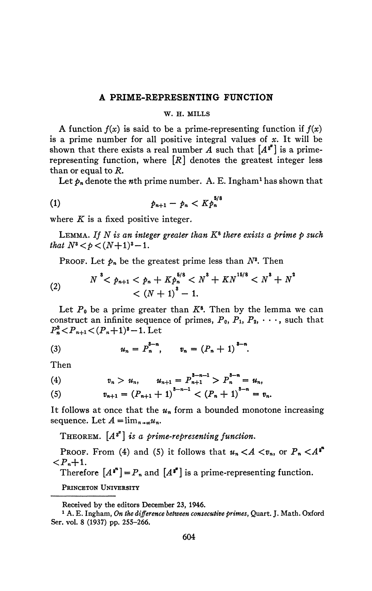

Stała Millsa jest jednym z tych wyników teorii liczb, które brzmią prawie jak sztuczka: istnieje taka liczba rzeczywista A, że kolejne wartości

⌊A3ⁿ⌋

są liczbami pierwszymi. Nie chodzi jednak o praktyczny algorytm produkowania pierwszych, tylko o eleganckie twierdzenie egzystencjalne: jedna liczba rzeczywista może zakodować nieskończony ciąg liczb pierwszych.

<figure class="infographic-figure">
  
  <figcaption>Stała Millsa wybiera liczby pierwsze przez potęgowanie jednej liczby rzeczywistej i branie części całkowitej.</figcaption>
</figure>

Najczęściej cytowana wartość tej stałej to:

A ≈ 1.3063778838630806904686144926…

Dla niej początek ciągu wygląda tak:

⌊A³⌋ = 2

⌊A⁹⌋ = 11

⌊A²⁷⌋ = 1361

⌊A⁸¹⌋ = 2521008887

Te liczby nazywa się czasem liczbami pierwszymi Millsa.

## Skąd bierze się konstrukcja?

Jeżeli chcemy mieć:

pₙ = ⌊A3ⁿ⌋

to musi zachodzić:

pₙ ≤ A3ⁿ &lt; pₙ + 1

Po wzięciu pierwiastka dostajemy przedział, w którym musi leżeć A:

pₙ1/3ⁿ ≤ A &lt; (pₙ + 1)1/3ⁿ

Każda kolejna liczba pierwsza zawęża więc możliwe położenie stałej. Konstrukcja działa tak, aby te przedziały były ze sobą zgodne.

Załóżmy, że mamy już liczbę pierwszą pₙ. Ponieważ:

A3ⁿ⁺¹ = (A3ⁿ)³

następna liczba pierwsza powinna leżeć między kolejnymi sześcianami:

pₙ³ &lt; pₙ₊₁ &lt; (pₙ + 1)³

Na przykład dla p₁ = 2 szukamy liczby pierwszej między 8 i 27. Najmniejsza taka liczba to 11. Potem między 11³ = 1331 i 12³ = 1728 pojawia się 1361. Dalej z 1361³ wychodzi kolejny ogromny przedział, w którym można wybrać następną liczbę pierwszą.

## Dlaczego sześciany?

Kluczowy fakt jest taki, że między kolejnymi sześcianami odstęp jest duży:

(x + 1)³ - x³ = 3x² + 3x + 1

Dla dużego x to bardzo szeroki przedział. Mills użył znanych wyników o przerwach między liczbami pierwszymi, aby zagwarantować, że w takim przedziale znajdzie się liczba pierwsza.

Gdyby zamiast wykładników 3ⁿ użyć 2ⁿ, trzeba byłoby gwarantować liczby pierwsze między kolejnymi kwadratami:

x² i (x + 1)²

To jest znacznie trudniejsze i prowadzi do hipotezy Legendre’a, która pozostaje nierozwiązana. Sześciany dają więcej miejsca, dlatego konstrukcja Millsa jest osiągalna znanymi metodami.

## Dlaczego to nie jest generator?

Formalnie wzór:

⌊A3ⁿ⌋

daje liczby pierwsze. Praktycznie nie jest to jednak użyteczny generator. Żeby policzyć duże n, trzeba znać A z ogromną precyzją. A te kolejne cyfry stałej są wyznaczane przez kolejne liczby pierwsze z konstrukcji.

Innymi słowy: stała Millsa nie daje taniej drogi do nowych liczb pierwszych. Ona raczej pokazuje, że można ukryć nieskończony ciąg liczb pierwszych w jednej liczbie rzeczywistej.

Najkrócej: sedno stałej Millsa polega na kodowaniu, nie na obliczeniowej praktyczności.
