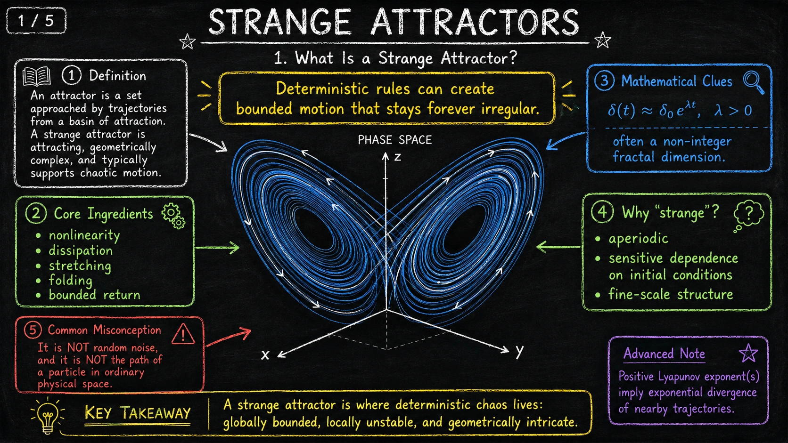
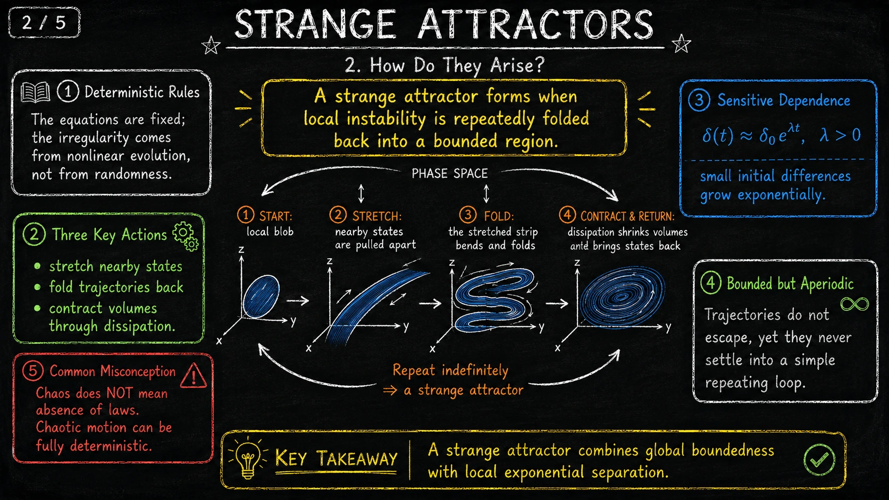
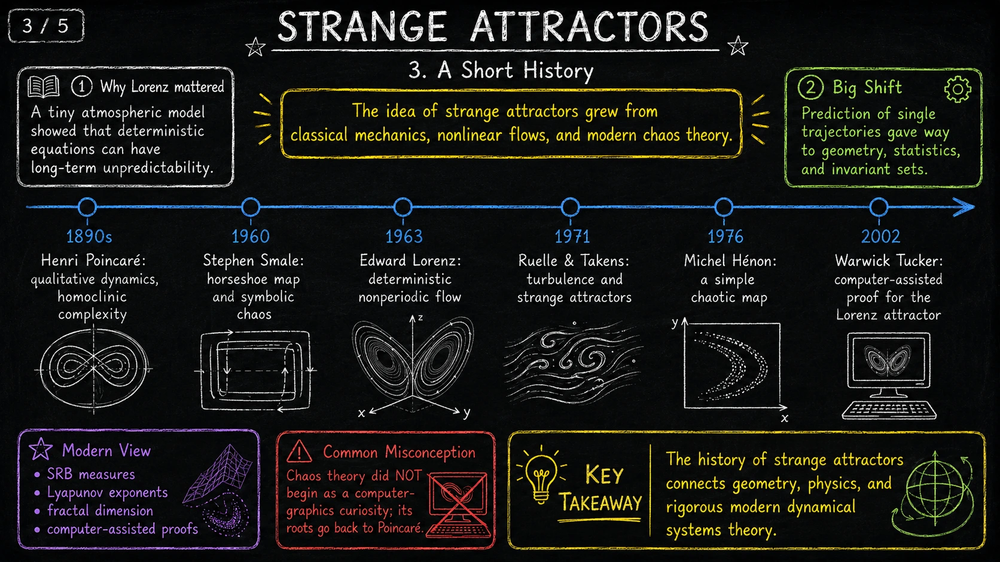
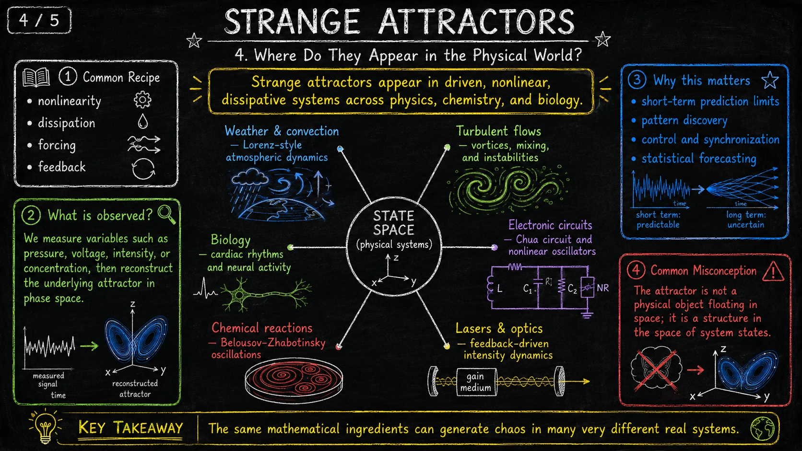
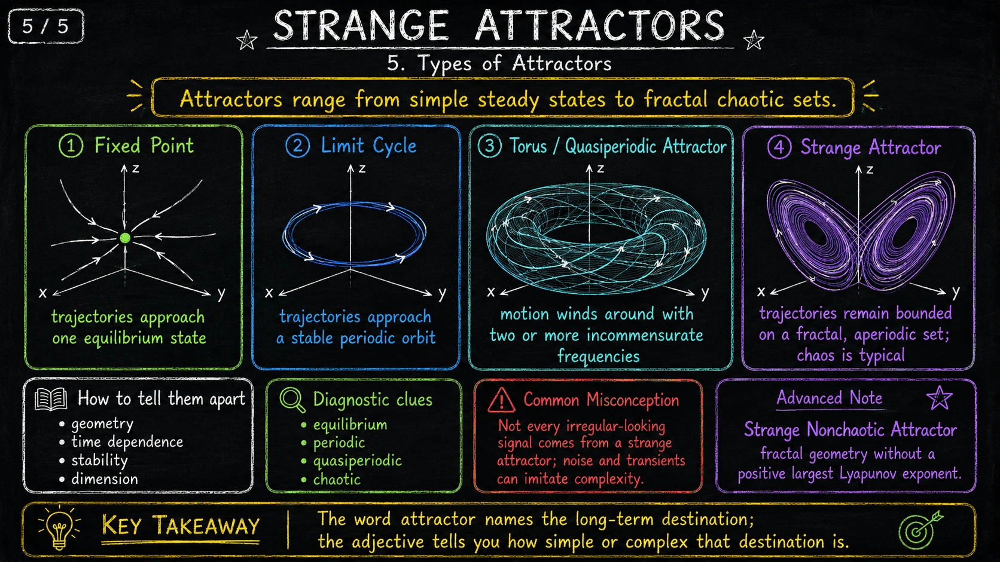
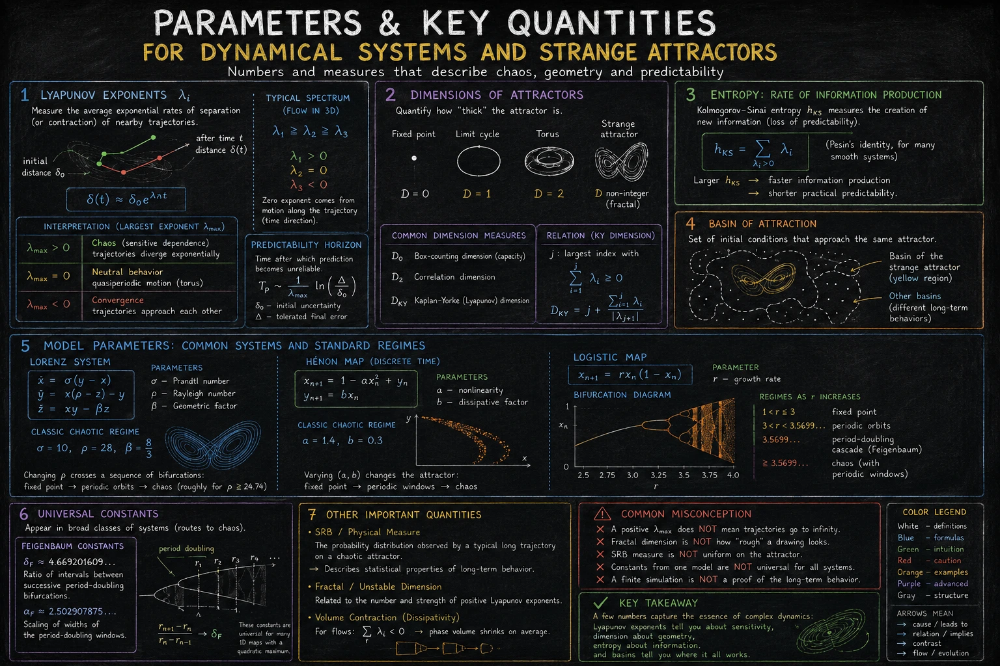
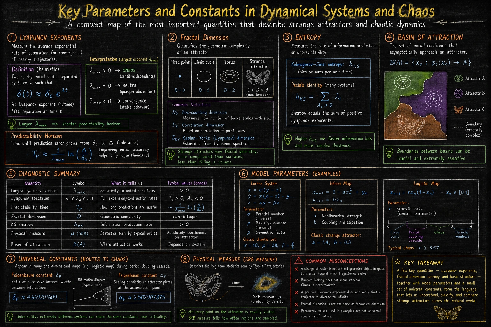

Chaos w matematyce nie oznacza braku praw. Przeciwnie: najciekawsze przykłady chaosu biorą się z bardzo konkretnych równań, w których nie ma losowego szumu. Reguły są deterministyczne, ale długoterminowe zachowanie staje się praktycznie nieprzewidywalne, bo małe różnice na starcie rosną wykładniczo.

Dziwny atraktor jest geometrycznym obrazem takiego zjawiska. To nie jest fizyczny obiekt unoszący się w przestrzeni, tylko zbiór w przestrzeni stanów: długoterminowy cel trajektorii układu. Jest „atraktorem”, bo przyciąga wiele trajektorii z pewnego basenu początków. Jest „dziwny”, bo jego geometria jest złożona, często fraktalna, a ruch na nim pozostaje aperiodyczny.

Poniższe siedem plansz prowadzi od intuicji do parametrów: czym jest dziwny atraktor, jak powstaje, skąd wzięła się ta idea, gdzie pojawia się w świecie fizycznym, jakie są typy atraktorów i które liczby opisują czułość, geometrię oraz przewidywalność układu.

## 1. Czym jest dziwny atraktor

<figure class="infographic-figure">
  
  <figcaption>Dziwny atraktor łączy globalne ograniczenie ruchu z lokalną niestabilnością i złożoną geometrią w przestrzeni fazowej.</figcaption>
</figure>

Atraktor to zbiór, do którego zbliżają się trajektorie startujące z pewnego obszaru warunków początkowych. Może być bardzo prosty: jeden punkt równowagi albo stabilna orbita okresowa. Dziwny atraktor jest innym przypadkiem. Trajektorie pozostają w ograniczonym obszarze, ale nie stabilizują się w jednym punkcie ani w prostej pętli.

Kluczowe składniki to nieliniowość, dyssypacja, rozciąganie, składanie i powrót do ograniczonego obszaru. Nieliniowość pozwala dynamice mieszać kierunki ruchu. Dyssypacja kurczy objętości w przestrzeni stanów. Rozciąganie rozdziela bliskie stany, a składanie zawraca je do tego samego regionu.

Dlatego chaos deterministyczny nie jest zwykłym szumem. Jeżeli dwa bardzo bliskie stany początkowe oddalają się przeciętnie wykładniczo,

δ(t) ≈ δ0eλt, przy λ &gt; 0

mówimy o dodatnim wykładniku Lapunowa. To jest matematyczny ślad wrażliwości na warunki początkowe.

## 2. Jak powstają dziwne atraktory

<figure class="infographic-figure">
  
  <figcaption>Mechanizm jest powtarzalny: lokalne rozdzielanie trajektorii jest wielokrotnie składane z powrotem do ograniczonego obszaru.</figcaption>
</figure>

Najprostsza intuicja jest geometryczna. Wyobraźmy sobie mały obłok bliskich stanów w przestrzeni fazowej. Dynamika najpierw go rozciąga: punkty, które zaczynały prawie razem, zaczynają kodować różne przyszłości. Potem rozciągnięty pasek jest składany, tak aby nie uciekł do nieskończoności. Dyssypacja kurczy objętość, a mechanizm powrotu wprowadza stany znowu do aktywnego regionu dynamiki.

Powtarzanie tego procesu daje obiekt, który jest ograniczony, ale nie prosty. Trajektoria nie wypada z układu, ale też nie zamyka się w krótkim cyklu. Z zewnątrz ruch może wyglądać nieregularnie, jednak nieregularność wynika z nieliniowej ewolucji, a nie z braku praw.

To rozróżnienie jest ważne praktycznie. Chaotyczny sygnał może być w pełni deterministyczny. Z drugiej strony nie każdy nieregularny sygnał jest chaosem: szum pomiarowy, przejścia przejściowe i źle dobrany model mogą imitować złożoność.

## 3. Krótka historia

<figure class="infographic-figure">
  
  <figcaption>Historia dziwnych atraktorów łączy geometrię, fizykę, jakościową teorię równań różniczkowych i komputerowo wspomagane dowody.</figcaption>
</figure>

Chaos nie zaczął się jako ciekawostka komputerowa. Już Henri Poincaré pokazał pod koniec XIX wieku, że układy mechaniczne mogą mieć bardzo złożoną strukturę orbit. Później Stephen Smale wprowadził model podkowy, który stał się jednym z klasycznych geometrycznych obrazów chaosu symbolicznego.

W 1963 roku Edward Lorenz opisał prosty model konwekcji atmosferycznej, w którym deterministyczne równania dawały długoterminową nieprzewidywalność. To właśnie atraktor Lorenza stał się ikoną chaosu: nie dlatego, że model pogody był kompletny, ale dlatego, że mały układ równań pokazał zasadę działania.

W latach 70. Ruelle i Takens powiązali turbulencję z nowoczesną teorią atraktorów, a Michel Hénon podał prostą dyskretną mapę z chaotycznym atraktorem. W 2002 roku Warwick Tucker przedstawił komputerowo wspomagany dowód istnienia atraktora Lorenza w rygorystycznym sensie matematycznym.

Współczesny język przesunął akcent z przewidywania pojedynczej trajektorii na geometrię, statystykę i niezmiennicze zbiory. Gdy długoterminowa predykcja punkt po punkcie jest niemożliwa, nadal można badać kształt atraktora, wykładniki Lapunowa, miary fizyczne i średnie własności ruchu.

## 4. Gdzie pojawiają się w świecie fizycznym

<figure class="infographic-figure">
  
  <figcaption>Te same składniki matematyczne: nieliniowość, wymuszenie, sprzężenie zwrotne i dyssypacja, pojawiają się w wielu różnych układach fizycznych.</figcaption>
</figure>

Dziwne atraktory pojawiają się najczęściej w układach nieliniowych, dyssypatywnych i wymuszanych albo sprzężonych zwrotnie. Dlatego można ich szukać w bardzo różnych dziedzinach: w pogodzie i konwekcji, przepływach turbulentnych, obwodach elektronicznych, laserach, reakcjach chemicznych, rytmach biologicznych czy aktywności neuronowej.

W eksperymencie zwykle nie widzimy od razu całej przestrzeni stanów. Mierzymy sygnał: ciśnienie, napięcie, intensywność, stężenie, położenie albo rytm. Następnie próbujemy odtworzyć strukturę dynamiki w przestrzeni fazowej lub w przestrzeni zrekonstruowanej z opóźnień czasowych.

Po co to robić? Bo atraktor może ujawnić ograniczenia krótkoterminowej predykcji, typowe wzorce ruchu, przejścia między reżimami, możliwość synchronizacji albo punkty, w których sterowanie układem staje się szczególnie trudne.

## 5. Typy atraktorów

<figure class="infographic-figure">
  
  <figcaption>Słowo „atraktor” mówi o długoterminowym celu ruchu; przymiotnik mówi, jak prosta albo złożona jest geometria tego celu.</figcaption>
</figure>

Nie każdy atraktor jest dziwny. Punkt stały oznacza, że trajektorie dążą do jednego stanu równowagi. Cykl graniczny oznacza stabilną orbitę okresową. Torus quasiokresowy pojawia się wtedy, gdy ruch składa się z dwóch lub więcej niewspółmiernych częstości i nie zamyka się w prostej pętli.

Dziwny atraktor jest bardziej złożony: trajektorie pozostają ograniczone, ale poruszają się po fraktalnym lub bardzo drobno ustrukturyzowanym zbiorze. Chaos jest wtedy typowy, choć trzeba uważać na jedno zastrzeżenie z planszy: istnieją też dziwne atraktory niechaotyczne, które mają złożoną geometrię bez dodatniego największego wykładnika Lapunowa.

Rozróżnienie typów atraktorów nie jest tylko estetyczne. Pomaga diagnozować układ: czy dąży do równowagi, oscyluje okresowo, ma ruch quasiokresowy, czy wchodzi w reżim chaotyczny.

## 6. Parametry i wielkości kluczowe

<figure class="infographic-figure">
  
  <figcaption>Ten arkusz zbiera liczby, które opisują czułość na warunki początkowe, geometrię atraktora, tempo utraty informacji i reżimy modeli.</figcaption>
</figure>

Najważniejszą liczbą diagnostyczną jest największy wykładnik Lapunowa, oznaczany jako λmax. Jeśli jest dodatni, bliskie trajektorie rozbiegają się wykładniczo i pojawia się czułość na warunki początkowe. Jeśli jest równy zero, mamy często zachowanie neutralne, na przykład quasiokresowe. Jeśli jest ujemny, trajektorie zwykle zbliżają się do siebie.

Z wykładnikiem Lapunowa wiąże się horyzont przewidywalności. Nawet jeśli znamy stan początkowy z błędem δ0, po pewnym czasie błąd urośnie do tolerancji Δ. Przybliżenie

Tp ≈ (1 / λmax) ln(Δ / δ0)

pokazuje, że poprawa dokładności początkowej pomaga tylko logarytmicznie.

Druga grupa liczb opisuje geometrię. Punkt ma wymiar 0, cykl wymiar 1, torus wymiar 2, a dziwny atraktor może mieć wymiar niecałkowity. W praktyce spotyka się wymiar pudełkowy, korelacyjny i Kaplan-Yorke'a. Entropia Kołmogorowa-Sinaja mierzy natomiast tempo produkcji informacji, czyli tempo utraty praktycznej przewidywalności.

Na dole planszy pojawiają się konkretne modele: układ Lorenza, mapa Hénona i mapa logistyczna. To ważne przykłady, bo pokazują, że chaos można badać zarówno w przepływach ciągłych, jak i w układach dyskretnych.

## 7. Mapa parametrów i stałych

<figure class="infographic-figure">
  
  <figcaption>Ostatnia plansza porządkuje język diagnostyczny: które wielkości mierzą wrażliwość, które geometrię, które informację, a które strukturę basenów.</figcaption>
</figure>

Ta plansza jest bardziej ściągą niż kolejnym krokiem narracji. Zbiera najważniejsze pojęcia w jednym miejscu: wykładniki Lapunowa, wymiar fraktalny, entropię, basen przyciągania, przykładowe parametry modeli, stałe Feigenbauma i miarę SRB.

Basen przyciągania mówi, które warunki początkowe asymptotycznie trafiają do danego atraktora. Granice między basenami mogą być fraktalne, więc mała zmiana startu może przerzucić układ do zupełnie innego długoterminowego zachowania. To jest inny rodzaj wrażliwości niż samo rozbieganie się trajektorii na jednym atraktorze.

Stałe Feigenbauma pokazują jeszcze inną lekcję: bardzo różne jednowymiarowe mapy mogą przechodzić do chaosu przez podobną kaskadę podwojeń okresu, z tymi samymi uniwersalnymi skalami. To jedna z przyczyn, dla których teoria chaosu nie jest tylko katalogiem osobnych przykładów, ale wspólnym językiem dla całych klas układów.

Miara SRB opisuje statystyki widziane przez typową długą trajektorię na atraktorze. Dzięki temu można mówić o tym, jak często trajektoria odwiedza różne regiony, nawet gdy nie potrafimy przewidzieć jej dokładnego położenia po długim czasie.

Najkrótsze podsumowanie jest takie: wykładniki Lapunowa mówią o czułości, wymiary o geometrii, entropia o informacji, baseny o tym, skąd dokąd prowadzi dynamika, a parametry modeli mówią, kiedy układ przechodzi między reżimami.

---

Kontekst i dalsza lektura: [strange attractor](https://en.wikipedia.org/wiki/Attractor#Strange_attractor), [Lorenz system](https://en.wikipedia.org/wiki/Lorenz_system), [Lyapunov exponent](https://en.wikipedia.org/wiki/Lyapunov_exponent), [Feigenbaum constants](https://en.wikipedia.org/wiki/Feigenbaum_constants) oraz [dynamical systems theory](https://en.wikipedia.org/wiki/Dynamical_systems_theory). Infografiki pochodzą z materiałów wygenerowanych w ChatGPT.
