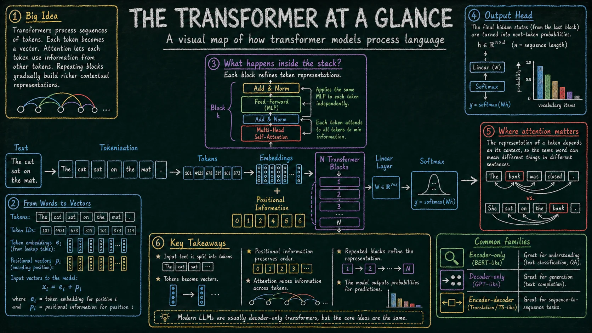
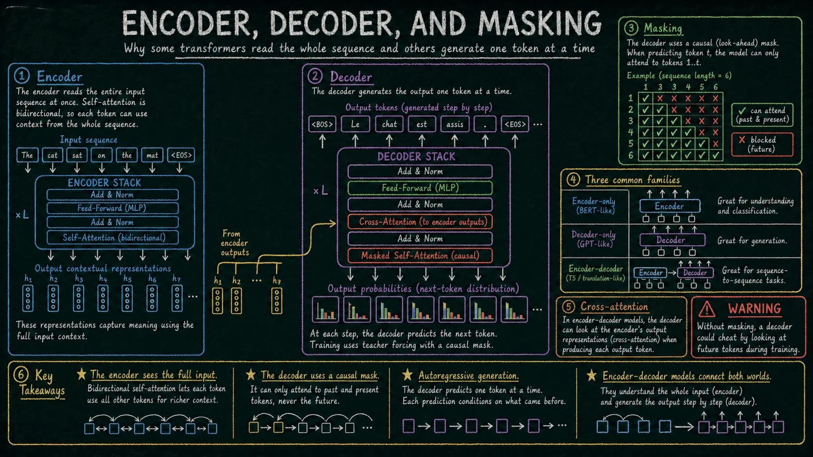
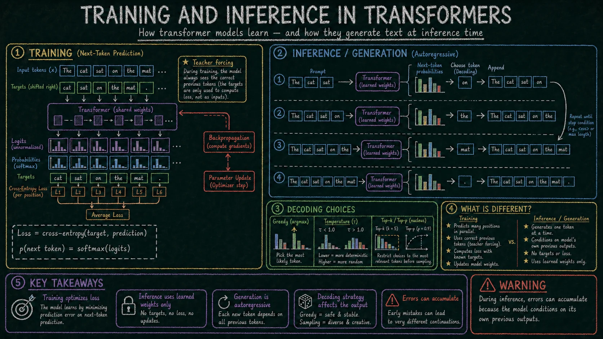
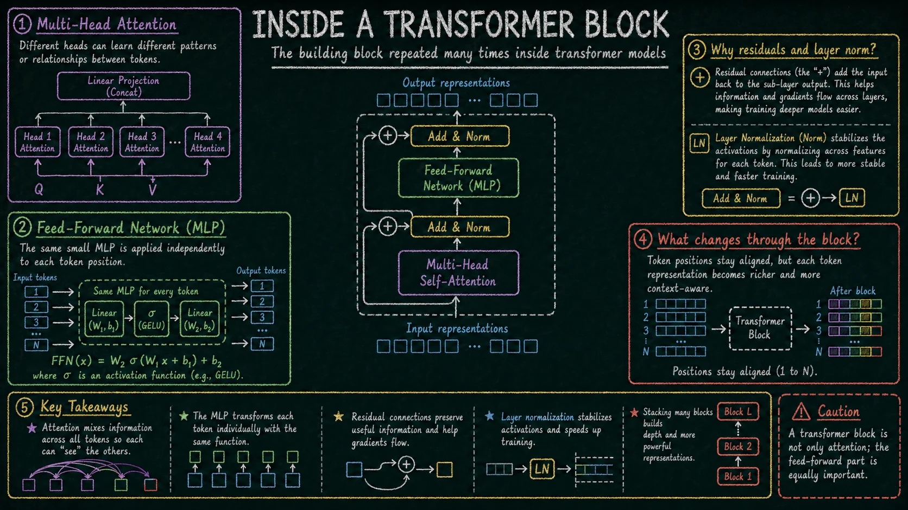
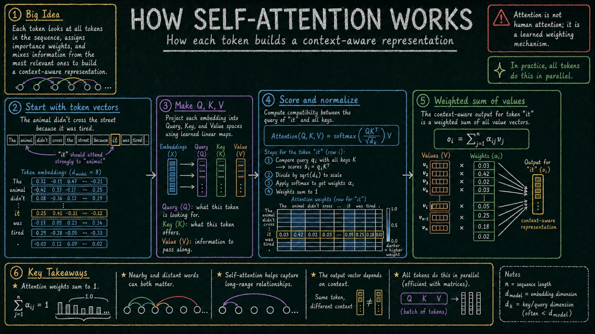
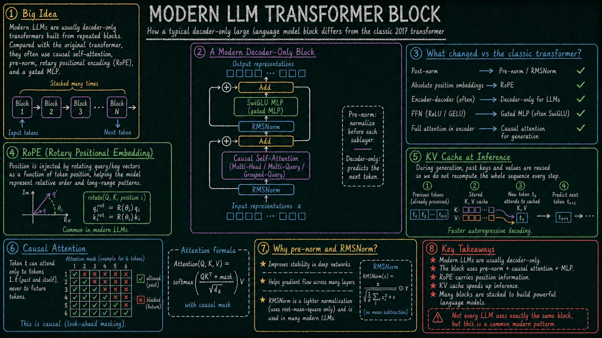

Transformer jest dziś podstawową architekturą większości dużych modeli językowych. Najlepiej rozumieć go nie jako jedną „magiczną” warstwę, ale jako powtarzalny mechanizm przetwarzania sekwencji: tekst zostaje podzielony na tokeny, tokeny są zamieniane na wektory, a kolejne bloki modelu stopniowo wzbogacają te wektory o kontekst.

Poniżej jest krótka ścieżka przez sześć grafik. Każda pokazuje inny poziom szczegółowości: od ogólnego przepływu danych, przez self-attention, aż po współczesny blok używany w modelach LLM.

## 1. Ogólny przepływ

<figure class="transformer-figure">
  
  <figcaption>Ogólny schemat transformera: tokenizacja, embeddingi, informacja pozycyjna, stos bloków transformera i wyjście modelu.</figcaption>
</figure>

Na wejściu model nie widzi zdań tak jak człowiek. Tekst jest dzielony na tokeny, czyli jednostki przetwarzania modelu. Token nie musi być całym słowem — może być fragmentem słowa, znakiem interpunkcyjnym albo specjalnym symbolem.

Każdy token zostaje zamieniony na wektor liczbowy, czyli embedding. Sam embedding tokenu nie mówi jednak, gdzie token znajduje się w sekwencji. Dlatego model musi dostać informację o pozycji: w klasycznych transformerach przez dodanie wektorów pozycyjnych, a w wielu nowoczesnych LLM przez mechanizmy takie jak RoPE, które wprowadzają pozycję bezpośrednio do obliczeń attention.

Następnie reprezentacje tokenów przechodzą przez wiele podobnych bloków transformera. Każdy blok aktualizuje reprezentację każdego tokenu: attention miesza informacje między tokenami, a MLP przetwarza każdy token osobno. Na końcu model zamienia ostatnie reprezentacje na logity, a potem na prawdopodobieństwa kolejnych tokenów albo na inne wyjście zależne od zadania.

## 2. Self-attention

<figure class="transformer-figure">
  
  <figcaption>Schemat self-attention z reprezentacjami query, key i value oraz wagami uwagi między tokenami.</figcaption>
</figure>

Self-attention odpowiada na pytanie: z których tokenów model powinien skorzystać, aktualizując reprezentację danego tokenu? Dla każdego tokenu model tworzy trzy projekcje: query, key i value.

Query można traktować jako opis tego, czego dany token „szuka” w kontekście. Key opisuje, co inne tokeny mogą zaoferować. Value niesie informację, która zostanie przekazana dalej, jeśli dany token okaże się istotny.

Model porównuje query z key dla wszystkich tokenów i otrzymuje score’y podobieństwa. Po przeskalowaniu i przejściu przez softmax score’y stają się wagami attention, które sumują się do 1. Te wagi określają, jak mocno reprezentacja aktualnego tokenu ma korzystać z informacji z pozostałych tokenów.

W praktyce self-attention działa w wielu głowach równolegle. Różne głowy mogą uczyć się różnych typów zależności: lokalnych, składniowych, semantycznych albo pozycyjnych. Nie trzeba jednak zakładać, że każda głowa ma prostą, jednoznaczną interpretację.

## 3. Wnętrze bloku transformera

<figure class="transformer-figure">
  
  <figcaption>Wnętrze bloku transformera z attention, MLP, normalizacją i połączeniami residual.</figcaption>
</figure>

Typowy blok transformera składa się z dwóch głównych części. Pierwsza to self-attention, gdzie tokeny wymieniają informacje między sobą. Druga to MLP, czyli feed-forward network, gdzie każdy token jest przetwarzany niezależnie tą samą małą siecią neuronową.

Attention odpowiada za mieszanie informacji wzdłuż sekwencji: token może użyć kontekstu innych tokenów. MLP odpowiada za przekształcenie reprezentacji każdego tokenu już po uwzględnieniu tego kontekstu. Innymi słowy: attention miesza informacje między pozycjami, a MLP zwiększa nieliniową zdolność przetwarzania każdej pozycji.

Wokół tych operacji znajdują się normalizacje i połączenia residual. Normalizacja stabilizuje wartości aktywacji, a residuale pozwalają przenosić informację przez wiele warstw bez wymuszania, aby każda warstwa całkowicie przepisywała reprezentację od zera. Dzięki temu można budować głębokie modele złożone z dziesiątek albo setek bloków.

## 4. Encoder, decoder i modele encoder-decoder

<figure class="transformer-figure">
  
  <figcaption>Porównanie trzech rodzin transformerów: encoder-only, decoder-only i encoder-decoder.</figcaption>
</figure>

Encoder czyta całą sekwencję wejściową naraz. Jego self-attention jest zwykle dwukierunkowe, więc każdy token może korzystać z kontekstu po lewej i po prawej stronie. Taki wariant dobrze pasuje do zadań rozumienia tekstu: klasyfikacji, ekstrakcji cech, wyszukiwania semantycznego albo analizy pełnego wejścia.

Decoder generuje tekst krok po kroku. Używa causal mask, czyli maski blokującej dostęp do przyszłych tokenów. Podczas generowania model zna tylko prompt oraz tokeny wygenerowane wcześniej, dlatego nie może patrzeć na to, co dopiero ma zostać wygenerowane. Większość współczesnych dużych modeli językowych używanych do generowania tekstu to modele decoder-only.

Istnieje też wariant encoder-decoder. Encoder buduje reprezentację wejścia, a decoder generuje wyjście, korzystając zarówno z własnego kontekstu, jak i z reprezentacji encodera przez cross-attention. Taki układ był klasycznie używany w tłumaczeniu maszynowym i innych zadaniach sekwencja-do-sekwencji.

## 5. Trening i inferencja

<figure class="transformer-figure">
  
  <figcaption>Porównanie uczenia modelu i późniejszego generowania tekstu.</figcaption>
</figure>

W treningu decoder-only LLM model uczy się przewidywać następny token. Dostaje poprawny fragment sekwencji i ma przewidzieć kolejny element. W praktyce dla jednej sekwencji można policzyć stratę dla wielu pozycji naraz, ponieważ znane są wszystkie poprawne tokeny docelowe. To odróżnia trening od inferencji: trening może być silnie równoległy, a generowanie tekstu jest sekwencyjne.

Model zwraca logity, czyli nieznormalizowane wyniki dla możliwych tokenów. Softmax zamienia je na rozkład prawdopodobieństwa. Następnie strata, najczęściej cross-entropy, porównuje przewidywanie modelu z poprawnym tokenem. Backpropagation oblicza gradienty, a optymalizator aktualizuje parametry modelu.

Inferencja to używanie wytrenowanego modelu. Model dostaje prompt, oblicza prawdopodobieństwa następnego tokenu, wybiera token zgodnie ze strategią dekodowania i dopisuje go do kontekstu. Potem cały proces powtarza się dla kolejnego tokenu. Strategia dekodowania ma znaczenie: greedy wybiera najbardziej prawdopodobny token, sampling dodaje losowość, a temperature, top-k i top-p kontrolują zakres tej losowości.

## 6. Współczesny blok LLM

<figure class="transformer-figure">
  
  <figcaption>Współczesny blok decoder-only LLM z pre-norm, RMSNorm, causal self-attention, RoPE, MLP typu SwiGLU i residual stream.</figcaption>
</figure>

Nowoczesne LLM zachowują podstawową ideę transformera, ale wiele szczegółów różni się od pierwotnej architektury z 2017 roku. Typowy współczesny model językowy jest decoder-only, używa causal self-attention i generuje tekst autoregresyjnie, czyli token po tokenie.

Często spotykany wzorzec to pre-norm: normalizacja jest wykonywana przed attention i przed MLP, a nie dopiero po nich. W wielu modelach stosuje się RMSNorm zamiast klasycznej LayerNorm, ponieważ jest prostsza i dobrze sprawdza się w dużych sieciach. Pozycja tokenów często jest kodowana przez RoPE, które obraca wektory query i key w sposób zależny od pozycji, pomagając modelowi rozumieć relacje względne między tokenami.

W części attention nowoczesne modele mogą używać klasycznego multi-head attention, multi-query attention albo grouped-query attention. Te warianty zmniejszają koszt pamięciowy i przyspieszają inferencję. Szczególnie ważny jest KV cache: podczas generowania model nie musi za każdym razem przeliczać kluczy i wartości dla całej wcześniejszej sekwencji, tylko przechowuje je i wykorzystuje ponownie.

MLP we współczesnych LLM często jest wariantem bramkowanym, na przykład SwiGLU. Taki MLP nadal działa osobno na każdym tokenie, ale ma większą elastyczność niż prosty feed-forward z ReLU albo GELU.

Najważniejsze pozostaje jednak to samo: blok LLM bierze strumień reprezentacji tokenów, normalizuje go, miesza informacje przez causal self-attention, dodaje wynik przez residual, potem przetwarza reprezentacje przez MLP i znów dodaje wynik do strumienia. Wiele takich bloków ułożonych jeden po drugim buduje coraz bogatsze reprezentacje, które na końcu służą do przewidywania następnego tokenu.

Nie każdy LLM używa dokładnie tego samego zestawu rozwiązań. RMSNorm, RoPE, SwiGLU, grouped-query attention i KV cache są jednak bardzo typowymi elementami współczesnych modeli decoder-only.

---

Infografiki zostały wygenerowane przy użyciu modelu [gpt-image-2](https://developers.openai.com/api/docs/models/gpt-image-2).
