## Wstęp

Termin „vibe coding” pojawił się publicznie 3 lutego 2025 roku, gdy Andrej Karpathy wrzucił na Twittera wpis, w którym opisał nowy sposób pisania kodu – taki, w którym „zapominasz, że kod w ogóle istnieje”. W ciągu kilku dni wyrażenie obiegło branżowe blogi, wywołało falę komentarzy entuzjastycznych i sceptycznych, a kilka tygodni później ja sam opublikowałem dwa artykuły: jeden o samej praktyce vibe codingu, drugi o tym, co roboczo nazwałem rolą „Vibe Operatora AI”. Był luty–marzec 2025. Miałem za sobą jeden ukończony projekt zbudowany w ten sposób: system transkrypcji i diaryzacji Sonus, który kosztował mnie czterdzieści godzin intensywnej, weekendowej pracy.

Jest marzec 2026. Przez ostatnie dwanaście miesięcy zbudowałem siedemnaście kolejnych projektów różnej wielkości. Mam dane o każdym: commity, koszt tokenów, godziny aktywności, decyzje architektoniczne, rzeczy, które nie wyszły. Mam narzędzie (`gitiary`), które to wizualizuje, i narzędzie (`command-center`), które raportuje koszty. Mam też dość kontekstu, żeby napisać coś więcej niż kolejny artykuł o tym, że AI zmienia programowanie.

Przede wszystkim moje spojrzenie trochę się zmieniło: wiem trochę więcej o tym, co mogę. Czy czegoś nie mogę zrobić, używając AI do tworzenia kodu? Nie próbowałem tworzyć kodu w powiązaniu z hardware’em (nie licząc gogli VR). Mam masę sprzętu, od kilkudziesięciu Odroidów po kilka Raspberry Pi, różne czujniki i sprzęt do LoRa/LoRaWAN. Do tej pory tworzyłem kod na własne potrzeby, więc zapewne bardziej przydałoby mi się oprogramowanie do automatycznego mierzenia czasu spędzonego przy pianinie (w środku jest Android) niż inteligentny system podlewania roślin.

> Kiedy myślę o tym, dlaczego generuję kod, najbliższe wydaje mi się określenie *personal software* – bo wiąże mnie z nim coś podobnego do relacji, jaką kiedyś miałem z własnym PC.

Komputer osobisty – aplikacja osobista? To nie jest prosta analogia. Komputer PC był narzędziem uniwersalnym, przeznaczonym dla każdego. Aplikacja osobista, którą tworzymy na własne potrzeby, jest czymś innym: nie musi interesować nas, czy przyda się komukolwiek poza nami. Z drugiej strony mamy „software on demand” – nie tylko dostęp do aplikacji dokładnie dopasowanej do naszych potrzeb, ale też możliwość samodzielnego wytworzenia jej na żądanie.

Wyobraźmy sobie dwie sceny. Jest rok 1995. Pani Krysia schodzi do pana Gienka z prośbą o sprawdzenie, dlaczego w gniazdkach w jej mieszkaniu nie ma prądu. Pan Gienek jest elektrykiem i uwinie się z tym w 15 minut. Jest rok 2034. Benek, wnuk pani Krysi, schodzi do wnuczki pana Gienka, Zosi, z prośbą, czy nie stworzyłaby aplikacji do kontroli innych aplikacji. Ma osobne aplikacje do Żabki, Lidla, Lewiatana, fryzjera, Netflixa, internetu, dwóch banków, trzech operatorów telefonii komórkowej, elektrowni, wspólnoty mieszkaniowej oraz cztery aplikacje urzędowe, a babcia (93 lata) zaczęła się gubić, czy wszystko płaci jak trzeba. Zosia wie, że od 2032 roku wymogiem aktu AI4UE jest posiadanie standardowego AiPI przez każdą komercyjną aplikację dostępną publicznie w Unii, więc w 15 minut tworzy odpowiednią apkę i wysyła ją Benkowi mailem. Benek instaluje ją jako nowy moduł w Inteligentnym Asystencie i od tej chwili Babcia Krysia może rozmawiać ze swoimi rachunkami.

Andrej Karpathy w tweecie z 19 lutego 2026 używa określenia „bespoke software”
(https://x.com/karpathy/status/2024583544157458452)

> Very interested in what the coming era of highly bespoke software might look like.
>
> Example from this morning - I've become a bit loosy goosy with my cardio recently so I decided to do a more srs, regimented experiment to try to lower my Resting Heart Rate from 50 -> 45, over experiment duration of 8 weeks. The primary way to do this is to aspire to a certain sum total minute goals in Zone 2 cardio and 1 HIIT/week.
>
> 1 hour later I vibe coded this super custom dashboard for this very specific experiment that shows me how I'm tracking. Claude had to reverse engineer the Woodway treadmill cloud API to pull raw data, process, filter, debug it and create a web UI frontend to track the experiment. It wasn't a fully smooth experience and I had to notice and ask to fix bugs e.g. it screwed up metric vs. imperial system units and it screwed up on the calendar matching up days to dates etc.
> 

>  
Rozwiń cały tweet

> But I still feel like the overall direction is clear:
> 1) There will never be (and shouldn't be) a specific app on the app store for this kind of thing. I shouldn't have to look for, download and use some kind of a "Cardio experiment tracker", when this thing is ~300 lines of code that an LLM agent will give you in seconds. The idea of an "app store" of a long tail of discrete set of apps you choose from feels somehow wrong and outdated when LLM agents can improvise the app on the spot and just for you.
> 2) Second, the industry has to reconfigure into a set of services of sensors and actuators with agent native ergonomics. My Woodway treadmill is a sensor - it turns physical state into digital knowledge. It shouldn't maintain some human-readable frontend and my LLM agent shouldn't have to reverse engineer it, it should be an API/CLI easily usable by my agent. I'm a little bit disappointed (and my timelines are correspondingly slower) with how slowly this progression is happening in the industry overall. 99% of products/services still don't have an AI-native CLI yet. 99% of products/services maintain .html/.css docs like I won't immediately look for how to copy paste the whole thing to my agent to get something done. They give you a list of instructions on a webpage to open this or that url and click here or there to do a thing. In 2026. What am I a computer? You do it. Or have my agent do it.
> 
> So anyway today I am impressed that this random thing took 1 hour (it would have been ~10 hours 2 years ago). But what excites me more is thinking through how this really should have been 1 minute tops. What has to be in place so that it would be 1 minute? So that I could simply say "Hi can you help me track my cardio over the next 8 weeks", and after a very brief Q&A the app would be up. The AI would already have a lot personal context, it would gather the extra needed data, it would reference and search related skill libraries, and maintain all my little apps/automations.
> 
> TLDR the "app store" of a set of discrete apps that you choose from is an increasingly outdated concept all by itself. The future are services of AI-native sensors & actuators orchestrated via LLM glue into highly custom, ephemeral apps. It's just not here yet.
> 
> 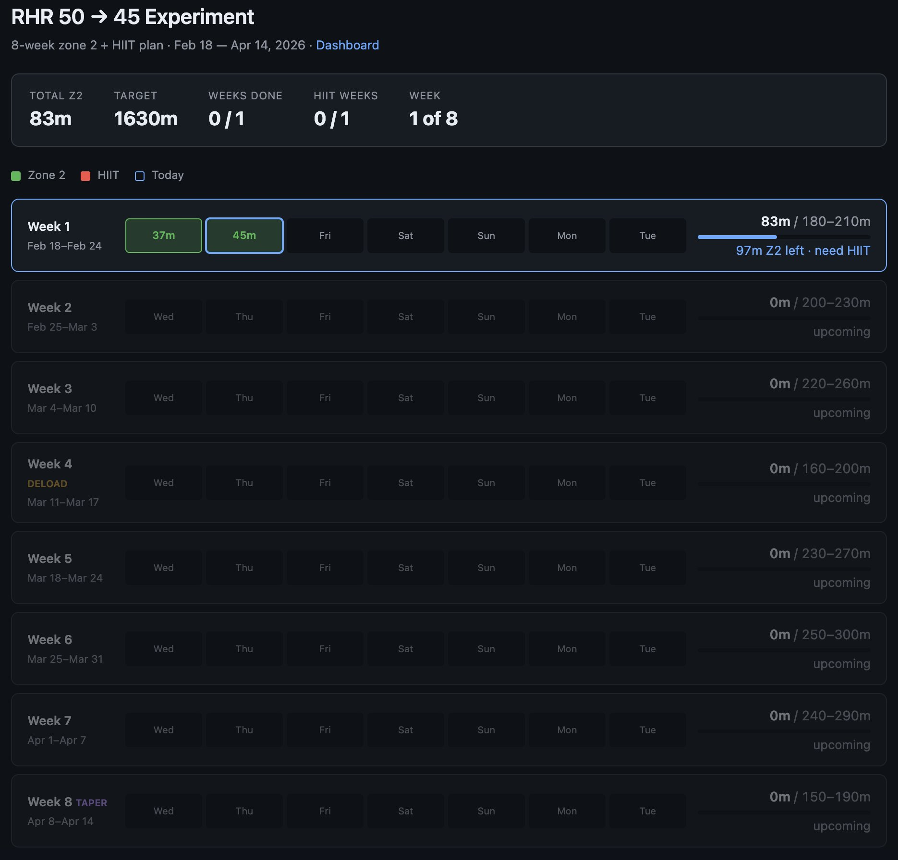

---
## Jak wygląda dzisiaj mój proces budowania aplikacji?

1. Pojawia się pomysł lub potrzeba, sprawdzam, czy oprogramowanie spełniające moje potrzeby już istnieje. Jeśli nie spełnia dokładnie moich potrzeb, dostosowuję je (np. `identity`).
2. Jeśli nie ma kodu open source, albo istniejący kod wymagałby więcej zmian, przechodzę do fazy projektowania. Przełączam ChatGPT w tryb rozszerzonego myślenia, włączam dyktowanie i opisuję pomysł. Na końcu proszę o analizę, krytykę oraz zadawanie pytań doprecyzowujących zagadnienie. Ten proces powtarzam do chwili, gdy wydaje mi się, że wszystkie aspekty aplikacji zostały omówione.
3. Na etapie projektowania proszę o trzy warianty stacku technologicznego: od najlżejszego do cięższego i bardziej zaawansowanego. Interesują mnie nie tylko możliwości każdego z nich, ale też ich wady, zalety i stopień rozpowszechnienia. Sam język programowania zwykle nie ma dla mnie kluczowego znaczenia, ale nie znaczy to, że wszystko da się równie łatwo zbudować w każdym ekosystemie.
4. Gdy temat jest już wstępnie rozpoznany, proszę o wygenerowanie dokumentu PRD.md z zarysem projektu.
5. Ten dokument załączam do konwersacji z Claude/Gemini, prosząc o analizę i krytykę. Odpowiedzi wklejam do ChatGPT, który odrzuca lub włącza poprawki w nowej wersji PRD. Taki proces powtarzam kilkukrotnie, aż Claude/Gemini przestaną zgłaszać uwagi albo zaczną zgłaszać uwagi zbyt drobiazgowe.
6. Tworzę projekt na GitHubie, zakładam lokalne repozytorium i uruchamiam Codexa (wcześniej Claude Code). Zwykle PRD jest podzielony na weryfikowalne fazy. Kod nie powstaje bez etapowej weryfikacji, tylko po każdej fazie mam mieć gotową część, którą mogę zweryfikować (np. wizualnie).
7. Po poprawkach, gdy mam wygenerowaną całość kodu i przetestowałem ją samodzielnie, generuję dokumentację i testy.
8. Jeśli mam dostęp do Gemini i mam szczęście, że działa, weryfikuję różne aspekty wygenerowanego kodu – architekturę, bezpieczeństwo, poprawność dokumentacji, pokrycie testami itp. Uwagi zgłaszam do Codexa z prośbą o weryfikację.
9. Czasami tworzę projekt „odwrotnie” – startuję od definicji pliku konfiguracyjnego i opisuję dokładnie każdą opcję konfiguracji. To jest mój punkt startowy: implementuję opcję po opcji, testuję poprawność, a potem przechodzę do kolejnego parametru.
10. Aktualnie staram się, by dokumentacja była jak najbardziej ogólna, tak, by zmiany w kodzie nie generowały kosztów aktualizacji dokumentacji. W tej chwili i tak szybciej jest zapytać Codexa o opcje programu, niż przedzierać się przez dokumentację.
11. Kiedy uznaję proces wytwórczy za skończony? W praktyce rzadko bywa to moment definitywny. Skoro jestem zarazem producentem i klientem, kod rozwija się dalej wraz z kolejnymi potrzebami. Używam programu, a gdy pojawia się błąd albo potrzeba nowej opcji, wracam do Codexa i po prostu dopisuję następny etap jego życia.
---
Proporcje czasu poświęcanego na tworzenie PRD i generowanie kodu aktualnie rozkładają się po połowie, ale to oczywiście zależy od skali projektu. Proces wytworzenia kodu może skończyć się wnioskiem, że pominąłem krytyczną rzecz na etapie projektowania. Z tego powodu czasami wracam do fazy projektowej, usuwam cały kod, poprawiam PRD i generuję kod od nowa. Miałem takie przypadki kilkukrotnie: czasami z mojej winy, a czasami z konieczności zmiany stacku ze względu na ograniczenia, które pojawiły się w fazie testów.

---
## KONTEKST – CO SIĘ ZMIENIŁO W CIĄGU ROKU

### 1.1 Luty 2025: termin, który zmienił rozmowę

Karpathy pisał o „vibe codingu” z perspektywy kogoś, kto robi projekty weekendowe:
> to nowy rodzaj kodowania, w którym „całkowicie poddajesz się wibracjom, akceptujesz wykładniczy wzrost możliwości i zapominasz, że kod w ogóle istnieje”. Widzisz błąd – wklejasz go do czatu. Coś nie działa – opisujesz i czekasz na poprawkę. Nie czytasz wygenerowanego kodu linijka po linijce. Efekt jest ważniejszy niż rozumienie implementacji.

Reakcja branży była przewidywalna. Entuzjaści złapali się słowa „demokratyzacja” i zaczęli pisać o tym, że teraz każdy może zostać programistą. Sceptycy złapali się słowa „vibe” i zaczęli pisać o długu technicznym, braku weryfikacji i ryzyku, że w produkcji poleci bezpieczeństwo. Andrew Ng powiedział publicznie, że nazwa jest „niefortunna” – bo sugeruje lekkość, podczas gdy praca z AI jest intelektualnie wymagająca i bywa wyczerpująca. Linus Torvalds był ostrożnie pozytywny wobec zastosowań edukacyjnych, ale ostrzegał przed konsekwencjami utrzymaniowymi w poważnych systemach. Podział między „vibe coding” jako opisem nowego sposobu pracy a „vibe coding” jako etykietą na nieodpowiedzialne inżynierstwo pojawił się błyskawicznie i nie zniknął.

Kiedy pisałem tamte artykuły, miałem za sobą Sonusa – projekt, który zbudowałem w cztery dni, samodzielnie, bez wcześniejszego doświadczenia z transkrypcją i diaryzacją audio. Model o3 napisał mi plik `StepByStep.md` z kompletną ścieżką budowy architektury. Claude 3.5 Sonnet robił kod. Ja pilnowałem, żeby plik nie urywał się przy aktualizacji i żeby `diff mode` w Cline nie rozwalał połowy kodu podczas refaktoryzacji.

Zbiegło się to z pierwszym publicznym ogłoszeniem Claude Code, 24 lutego 2025 roku. Tego dnia Anthropic opublikował wpis „Claude 3.7 Sonnet and Claude Code” i przedstawił Claude Code jako *command line tool for agentic coding*, dostępne wtedy w fazie ograniczonego podglądu badawczego. Udało mi się dostać do tego wczesnego programu i właściwie od początku CC stał się podstawowym narzędziem generowania kodu. Wcześniej testowałem Aider (aider.chat), ale był wyraźnie nieporęczny w użytkowaniu; użyłem go chyba tylko w dwóch–trzech projektach ML. Potem pojawił się Codex CLI, a następnie Gemini CLI. Próbowałem używać wszystkich trzech, równocześnie lub w zależności od wykupionej subskrypcji. Aktualnie używam prawie wyłącznie Codex CLI, czasami przy prostych skryptach sięgam po Gemini, ale w 90% przypadków Google odrzuca żądania z powodu przeciążenia (mam plan płatny).

To, co wtedy nazywałem „Vibe Operatorem AI”, było próbą nadania nazwy roli, w której człowiek nie pisze kodu, ale zarządza procesem jego powstawania: definiuje wymagania, wybiera architekturę, weryfikuje wynik, pilnuje jakości, debuguje rzeczy, których model nie rozumie na tyle dobrze, żeby sam je naprawić. Ta rola wciąż istnieje.

### 1.2 Rok 2025 w liczbach

Dane rynkowe z 2025 roku są w tej chwili dobrze znane, ale warto je zebrać w jednym miejscu, bo pokazują skalę zmiany. GitHub Copilot przekroczył 400 milionów dolarów rocznych przychodów przy wzroście przekraczającym 240% rok do roku. Cursor – edytor zbudowany wokół integracji z LLM – przekroczył miliard dolarów ARR w mniej niż dwa lata od startu. Badania pokazują, że 85% profesjonalnych deweloperów używa narzędzi AI w swojej pracy. Kohorta YC Winter 2025 zawierała 25% startupów, których baza kodu powstawała w 95% przy pomocy generatywnej AI.

Te liczby są prawdziwe i ważne. Ale ukrywają kilka rzeczy.

Po pierwsze, wzrost adopcji narzędzi nie równa się wzrostowi produktywności. Badanie METR z 2025 roku – jeden z nielicznych rzetelnych randomizowanych eksperymentów kontrolowanych w tym obszarze – pokazało, że doświadczeni maintainerzy pracujący na własnych repozytoriach z pomocą AI byli średnio o 19% wolniejsi niż bez niej. I jednocześnie postrzegali siebie jako szybszych. To brzmi jak paradoks, ale ma proste wyjaśnienie: AI przyspiesza generowanie kodu, ale spowalnia review, debugowanie i rozumienie tego, co zostało wygenerowane. Na własnych, dużych, skomplikowanych bazach kodu – gdzie kontekst jest trudny do przekazania modelowi – ta asymetria jest niekorzystna.

Po drugie, 400 milionów dolarów przychodów Copilota i miliard Cursora to dane o narzędziach do wspomagania programistów – nie o narzędziach, które zastępują programistów. Większość użycia to autouzupełnianie, podpowiedzi, refaktoryzacje i testy jednostkowe. Pełne kodowanie agentowe, gdzie model planuje i realizuje zadanie od specyfikacji do działającego kodu bez ciągłego nadzoru człowieka, jest wciąż mniejszością.

Po trzecie, dane o startupach YC, w których 95% kodu powstaje przy udziale AI, są ciekawe, ale mówią więcej o wczesnym etapie projektu niż o trwałości tej proporcji. Pierwsze 95% kodu to zazwyczaj szkielet aplikacji, powtarzalne elementy, konfiguracja, proste operacje CRUD i interfejs użytkownika. Ostatnie 5% – logika domenowa, przypadki brzegowe, integracje i optymalizacje – pochłania często połowę całego czasu pracy.

Z własnego doświadczenia: moje projekty z pierwszego kwartału 2025 roku mają wyższy stosunek kodu generowanego przez AI do łącznej objętości niż projekty z czwartego kwartału. Nie dlatego, że przestałem używać AI – wręcz przeciwnie, intensywność użycia wzrosła. Ale zmieniło się to, gdzie skupia się moja własna interwencja. Na początku nadzorowałem generowanie kodu. Teraz znacznie więcej czasu spędzam na specyfikacji, na projektowaniu struktur danych, na testowaniu brzegowych przypadków i na decyzjach architektonicznych, których model sam nie podejmie.

Jest też kontekst rynku pracy, który jest ważny dla pełnego obrazu. Dane z 2025 roku pokazują, że ogólna liczba ofert pracy w IT w USA spadła o kilkanaście procent względem poziomów przedpandemicznych. Jednocześnie rośnie popyt na specjalistów od integracji systemów AI, inżynierii kontekstu i zarządzania agentami. To nie jest demokratyzacja zawodu programisty w sensie „teraz każdy może to robić” – to zmiana kwalifikacji wymaganych od tych, którzy tę pracę wykonują. Przetasowanie, nie eliminacja. Przynajmniej na razie.

Warto też powiedzieć wprost o tym, co dane rynkowe ukrywają po stronie jakości. Szybko wygenerowany kod to nie zawsze dobry kod. Badania nad długiem technicznym w AI-generowanym kodzie są wciąż nieliczne i niejednoznaczne, ale intuicja inżynierska jest spójna: kod, który nie jest w pełni rozumiany przez autora, jest trudniejszy do utrzymania i debugowania. To nie jest argument przeciwko vibe codingowi – to argument za tym, żeby rozumieć, co robisz, nawet gdy AI generuje implementację. Różnica między „AI napisał ten kod” a „AI napisał ten kod, a ja rozumiem architekturę i logikę domeny” jest fundamentalna dla jakości długoterminowej.

### 1.3 Czym jest vibe coding w 2026

Karpathy mówił o projektach weekendowych. Cursor i Claude Code zmieniły skalę tego, co jest możliwe w jeden weekend – ale też zmieniły charakter pracy.

Kluczowe przesunięcie, które zaszło w 2025 roku, to zmiana jednostki pracy. Wcześniej pisałeś plik, funkcję, klasę. Teraz specyfikujesz zamiar, model planuje kroki, agent je wykonuje, Ty weryfikujesz wynik. To nie jest tylko „AI jako lepsze autouzupełnianie”. To fundamentalnie inny model interakcji z kodem: specyfikacja → plan → wykonanie → weryfikacja, a nie edycja → kompilacja → test → poprawka.

Claude Code to najlepszy przykład tego przesunięcia. Agent działa w terminalu, ma dostęp do narzędzi (pliki, grep, bash, testy), wykonuje akcje w pętli i raportuje wyniki. Nie generuje kodu do wklejenia – generuje kod, uruchamia go, widzi wynik, koryguje. To, co wyglądało jak koder, który potrzebuje nadzoru człowieka, zaczyna wyglądać jak junior developer, który potrzebuje seniora do przeglądu kodu i podejmowania decyzji architektonicznych.

MCP (Model Context Protocol) zmienił tę dynamikę jeszcze raz. Kiedy model może nie tylko generować kod, ale też wykonywać akcje w systemie – zapisywać pliki, wywoływać API, sterować przeglądarką, wysyłać komunikaty MIDI – granica między „asystentem kodowania” a „wykonawcą zadań” zaczyna być niejasna. Firma Anthropic opisuje MCP jako „USB-C dla aplikacji AI”: raz implementujesz protokół, odblokowujesz ekosystem integracji. W praktyce: model może być częścią pipeline’u produkcyjnego, a nie tylko narzędziem w IDE programisty.

Kontekstowo: Karpathy mówił też o bifurkacji środowiska inżynierów. Ci, którym podoba się samo rzemiosło pisania kodu – zrozumienie każdego bitu, elegancja algorytmu, precyzja implementacji – będą mieli z narzędziami AI relację inną niż ci, którym podoba się dostarczanie działających produktów, realizacja intencji i rozwiązywanie problemów. Ja jestem po stronie drugiej grupy. Dawno zidentyfikowałem się z rolą budowniczego, nie kodera, i rok z AI potwierdził, że to właściwy podział. Tym razem nie ma w tym żadnego wartościowania – obydwa podejścia mają rację bytu, ale wymagają innych narzędzi i innego podejścia do AI.

„Context engineering” – termin, który w 2025 roku przestał być tylko modnym hasłem i zaczął się pojawiać w dokumentacji narzędzi, w opisach stanowisk i w architekturach systemów – jest najlepszym opisem tego, co robi dobry Vibe Operator. To nie jest „lepsze promptowanie”. To systemowe projektowanie tego, co model widzi i kiedy to widzi: które pliki, które dane, który kontekst historii konwersacji, jakie reguły jakości zakodowane w plikach konfiguracyjnych. CEO Shopify, Tobi Lütke, zdefiniował context engineering jako „sztukę dostarczenia całego kontekstu tak, żeby zadanie było możliwe do rozwiązania przez LLM”. Bardziej technicznie: to zarządzanie optymalnym zestawem tokenów podczas inferencji – co wchodzi do kontekstu, w jakiej kolejności, w jakiej kompresji.

### 1.4 Stack, który wygrał

Moja ewolucja narzędziowa przez ostatnie dwanaście miesięcy była dość prosta: najpierw Cline + VS Code w pierwszych projektach (luty–maj 2025), potem Claude Code, a od końca 2025 roku Codex.

Dlaczego Claude Sonnet przez cały rok dominował jako model? Kilka razy próbowałem się przestawić na tańsze alternatywy – przy Sonusie testowałem kilka opcji, w tym modele open source z lokalnego serwera – i zawsze wracałem do Sonnet. Różnica nie jest w tym, że Sonnet pisze lepszy kod w izolacji. Różnica jest w tym, że przy długim kontekście, przy skomplikowanych architekturach wieloplikowych i przy trudnych instrukcjach z wieloma warunkami – Sonnet rzadziej gubi wątek, rzadziej produkuje kod, który działa lokalnie, ale nie w pipeline, i rzadziej wymaga kilku iteracji naprawiania tego, co sam zepsuł. Pamiętam, jak z Cline/Roo walczyło się o każdą linię kodu, refaktoryzacje po przekroczeniu 300 LOC, bo chwila dekoncentracji i Cline potrafił losowo wyciąć fragmenty kodu. Teraz w jednym rzucie Codex potrafi wygenerować 1500 LOC skryptu działającego od ręki. Mam kod, który wymaga refaktoryzacji, skrypt ma ponad 3000 LOC i nie ma problemu z jego rozwijaniem. Kontekst nie jest wyraźnie większy i lepszy niż rok temu, ale narzędzia są na tyle inteligentne, że potrafią zidentyfikować fragmenty kodu, których potrzebują do zrozumienia działania danej funkcjonalności.

Buforowanie promptów zmieniło ekonomikę długich sesji. Przy projekcie Sonus bufor promptów na Vertex AI nie był dostępny w czasie budowy – pojawił się kilka dni po zakończeniu projektu. Gdyby był, koszty sesji byłyby kilka razy niższe. To konkretna różnica architektoniczna: gdy masz duży system prompt i duże pliki konfiguracyjne, które trzeba dołączać do każdego wywołania, buforowanie prefiksu obniża koszt każdej wymiany proporcjonalnie do rozmiaru tej stałej części.

Narzędzie `command-center` dało mi w końcu dane o tym, jak wygląda moja własna ekonomia tokenów. Nie opiszę konkretnych liczb dla każdego projektu tutaj – to jest sekcja II – ale kluczowy wniosek jest taki: koszty nie rozkładają się równomiernie. Kilka intensywnych sesji (zazwyczaj te z największą ilością refaktoryzacji lub z trudnymi debugowaniami) generuje nieproporcjonalnie duży udział całkowitych kosztów. Świadomość tego zmieniła to, jak planuję projekty: lepsze przygotowanie specyfikacji i architektury przed kodowaniem = mniej kosztownych, długich sesji ratowania źle zaprojektowanych struktur.

MCP jako przełom był realny, ale potrzebował czasu na okrzepnięcie. W pierwszych miesiącach 2025 roku protokół był nowy, ekosystem serwerów ubogi, a dokumentacja fragmentaryczna. `mcp-midi-virtual-server` (kwiecień 2025) był moim pierwszym projektem, który eksperymentował z tą warstwą. `todoit` z integracją MCP (sierpień 2025) był pierwszym, gdzie ta integracja działała stabilnie w praktyce. Różnica rok do roku jest znaczna: w marcu 2026 MCP to dojrzały standard z szerokim ekosystemem, zaimplementowany przez OpenAI, Google DeepMind, Microsoft.

Jedna obserwacja o ewolucji narzędzi jest mniej oczywista niż inne: przejście z Cline + VS Code do Claude Code nie było dla mnie tylko zmianą interfejsu, ale zmianą modelu współpracy. W Cline + VS Code pracuję we własnym edytorze, wpisuję instrukcje do modelu, oglądam diff i akceptuję albo odrzucam zmiany. W Claude Code agentem staje się sam model: widzi system plików, uruchamia komendy, sprawdza testy i działa bardziej samodzielnie. To przesunięcie z „pair programming, gdzie jesteś kierowcą” do „pair programming, gdzie jesteś nawigatorem”. Obie role są wartościowe, ale wymagają innego rodzaju uwagi i innych umiejętności. Z czasem nauczyłem się pisać specyfikacje zadań dla agenta tak samo uważnie, jak wcześniej pisałem specyfikacje architektoniczne dla siebie.

W praktyce nie oznacza to jednak pełnego oddania sterów. Nadal mieszam tryb bardziej swobodny z trybem nadzorowanym: gdy buduję coś od zera, częściej pozwalam agentowi działać szerzej, a przy poprawkach częściej sprawdzam, czy zmiany trafiają tam, gdzie powinny. Czasem agent modyfikuje więcej, niż trzeba, i generuje kod nadmiarowo, który później wymaga uproszczenia albo refaktoryzacji. Zdarza się też, że jakość jego działania jest nierówna: raz prowadzi pracę bardzo sprawnie, a innym razem wyraźnie gubi precyzję. Niezależnie od przyczyny, praktyczny wniosek jest dla mnie prosty: praca z agentem wymaga nie tylko dobrych poleceń na wejściu, ale też stałej gotowości do oceny zakresu i sensu zmian.

Mam także wrażenie, że Claude Code działa falami i nie jest to wyłącznie moja prywatna metafora. W publicznych komentarzach użytkowników regularnie wraca motyw dni bardzo dobrych, kiedy agent jest szybki, precyzyjny i jakby „czytał w myślach”, po których przychodzą dni wyraźnie słabsze, pełne niepotrzebnych ruchów, gubienia precyzji i dziwnych odchyleń jakości. Anthropic sam kilkukrotnie opisywał incydenty wpływające na stabilność i jakość działania modeli, a użytkownicy Claude Code raportowali także niespójne przełączanie modeli czy fallbacki. Nie twierdzę, że stoi za tym jedna prosta reguła. Twierdzę tylko, że z perspektywy człowieka siedzącego po drugiej stronie terminala efekt bywa właśnie taki, jakby narzędzie miało własną pogodę.

### 1.5 Co wtedy wydawało się oczywiste, a dziś wygląda inaczej

Kilka przekonań z początku 2025 roku przeszło przez rok praktyki i wyszło albo potwierdzone, albo mocno zmodyfikowane.

**„AI rozumie kontekst”** – prawda, ale do pewnego rozmiaru bazy kodu. Przy małym projekcie (do kilku plików, do tysiąca linii kodu) model ma zazwyczaj dobry ogląd tego, co robi. Przy większym projekcie (powiedzmy: pięć tysięcy linii kodu w dziesięciu plikach) model ma ogląd fragmentaryczny i produkuje kod, który jest spójny lokalnie, ale nie globalnie. `37degrees` – mój największy projekt, aktywny przez cztery miesiące – nauczył mnie, że przy złożonych pipeline’ach trzeba bardzo dokładnie zarządzać tym, co model wie i kiedy. 

**„Nie musisz rozumieć kodu”** – w wersji ekstremalnej to mit, który kosztuje. Możesz nie rozumieć *każdej linii*, ale musisz rozumieć *domenę* i *architekturę*. Jeśli nie rozumiesz, co robi transkrypcja audio z diaryzacją, nie jesteś w stanie ocenić, czy pipeline WhisperX + pyannote jest zaimplementowany poprawnie. Jeśli nie rozumiesz, czym jest architektura zdarzeniowa, nie jesteś w stanie ocenić, czy model dobrze zaprojektował magistralę zdarzeń między komponentami. AI obniża koszt implementacji, ale nie obniża kosztu projektowania i oceny.

**„Model najlepiej radzi sobie z kodem Pythona”** – to była prawda w 2023 roku i jest mniej prawdą teraz. Przy projekcie `HSOF` w Julii i `any-item` w Rust model radził sobie zaskakująco dobrze, choć Rust szczególnie wymagał częstszych poprawek niż Python czy TypeScript. Jakość i przewidywalność generowanego kodu zależy mocno od języka – Python i TypeScript są wciąż w innej lidze niż Julia czy Rust – ale ta różnica zmalała przez rok.

**„Projekt weekendowy = vibe coding, projekt produkcyjny = nie”** – ten podział przestał być ostry. `Sonus` był produkcyjnym systemem cloudowym zbudowanym w vibe coding. `vbc` jest narzędziem, którego używam codziennie do kompresji terabajtów materiałów wideo, zbudowanym w vibe coding. Kluczem nie jest skala projektu, ale to, czy masz infrastrukturę weryfikacji: testy, CI, changelog, własny przegląd kodu lub dodatkową parę oczu. Z tą infrastrukturą vibe coding w produkcji jest możliwy. Bez niej – Karpathy miał rację, że to dobre tylko dla projektów weekendowych.

---

## METODA – JAK MIERZYĆ ROK KODOWANIA Z AI

### 2.1 Dlaczego w ogóle mierzyć

Pamięć o własnej pracy jest selektywna i systematycznie błędna. Pamiętam projekty, które działały dobrze i które mnie satysfakcjonowały. Zapominam o tych, które skończyłem na 70% i zostawiłem. Zapominam o sesjach, gdzie godzinami debugowałem to, co AI zepsuło przy ostatniej aktualizacji. Pamiętam wydatki na tokeny dla projektów, które dużo kosztowały.

### 2.2 gitiary – pulpit, który zamienia commity w opowieść

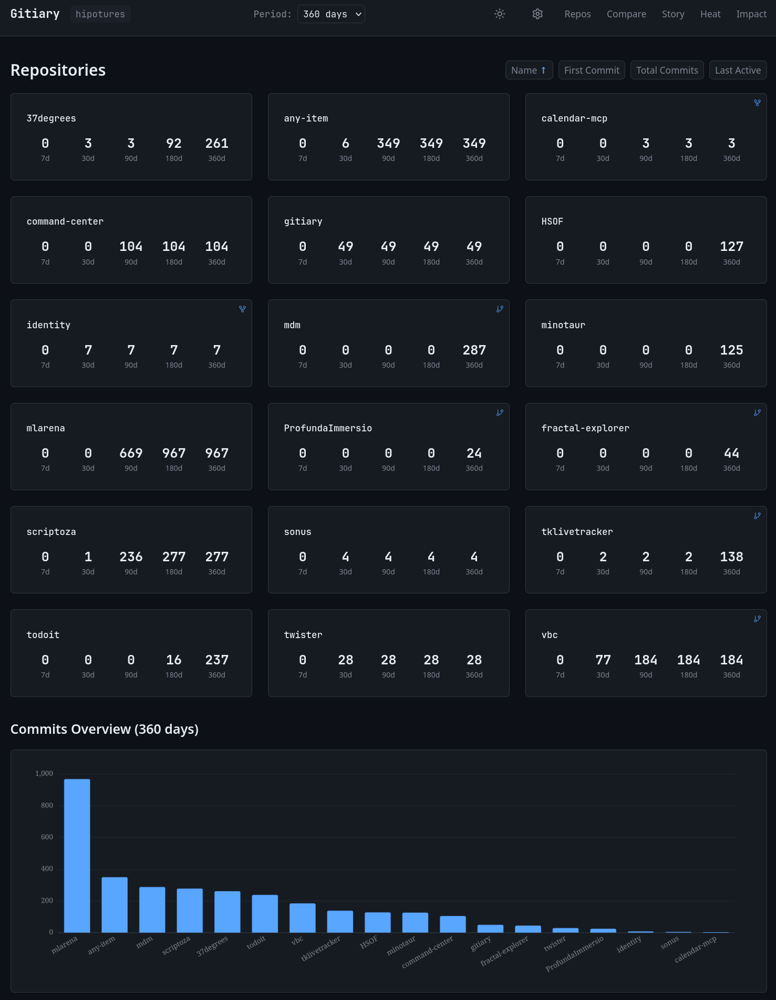

`gitiary` (GitHub: `hipotures/gitiary`, luty 2026, TypeScript). Miałem kilkanaście repozytoriów i chciałem zobaczyć w jednym miejscu, gdzie spędziłem czas w ostatnich dwunastu miesiącach. GitHub ma swój wykres wkładu, ale jest on liczony osobno dla każdego repozytorium i nie daje mi tego, czego potrzebuję: porównania aktywności między projektami, identyfikacji przerw, analizy rytmu pracy.

Architektura jest celowo prosta. Indexer (CLI w TypeScript) komunikuje się z GitHub przez GraphQL API, korzysta z autoryzacji GitHub CLI i zapisuje dane przyrostowo do SQLite przez Drizzle ORM. Frontend to SvelteKit z Apache ECharts do wizualizacji. Statyczny eksport – brak backendu produkcyjnego, hosting gdzie chcę. Indexer działa w trybie przyrostowym (aktualizuj od ostatniego checkpointu) i pełnym (przelicz całą historię), żeby szybkie odświeżanie nie wymagało skanowania całego grafu commitów.

Co pokazuje gitiary, czego nie pokazuje GitHub Insights:

Okna 7/30/90/180/360/all pozwalają na natychmiastową zmianę perspektywy. Przez dwa tygodnie intensywnie pracowałem nad `mlarena` – gitiary na oknie 30d pokazuje to wyraźnie jako dominujący projekt. Na oknie 360d wyraźnie widać, że `37degrees` miało trzy oddzielne fale intensywności przez cztery miesiące, z przerwami między nimi. 

Ranking regularności pokazuje, które projekty rozwijałem konsekwentnie, a które burstami. `todoit` – stały, systematyczny sprint przez kilka tygodni. `scriptoza` – kilka fal aktywności z wyraźnymi pauzami. `gitiary` – bardzo intensywne trzy dni i gotowe. Różne wzorce odpowiadają różnym typom pracy.

Metryki wpływu (linie dodane/usunięte, zmienione pliki, największe commity) korygują iluzję, że commit = jednostka pracy. Commit z dwoma zmienionymi liniami (poprawka bugfixa) i commit z siedmioma zmienionymi plikami (refaktoryzacja architektury) to dwie zupełnie różne jednostki nakładu pracy. `gitiary` pokazuje to, różnicując commity przez rozmiar.

Techniczne decyzje, które zrobiły robotę: statyczny eksport eliminuje pytanie „gdzie deployować i jak zarządzać backendami”. Przyrostowy indexer oznacza, że codzienne odświeżenie trwa sekundy. Vitest do testowania logiki statystyk oznacza, że rankingi i agregaty są weryfikowalne bez ręcznego sprawdzania obliczeń.

Jedno zdanie o liczbie commitów jako metryce: liczba commitów mierzy intensywność iteracji, nie jakość kodu ani wartość dostarczanego rozwiązania. Projekt z tysiącem małych commitów nie jest lepszy niż projekt z dwustoma przemyślanymi. `gitiary` to uwzględnia przez rozróżnienie między liczbą commitów a ich rozmiarem – ale ostatecznie każda metryka aktywności jest tylko przybliżeniem tego, co chce się mierzyć.

### 2.3 command-center – raport kosztów i tokenów

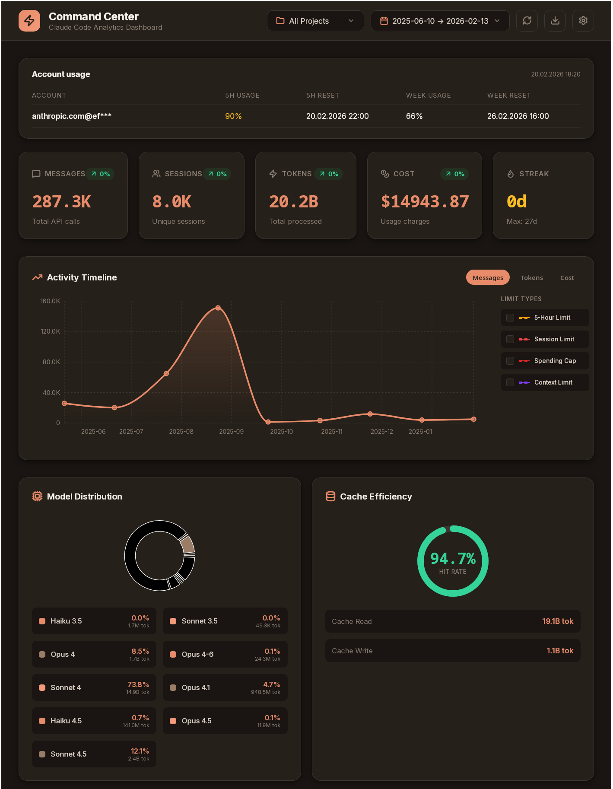
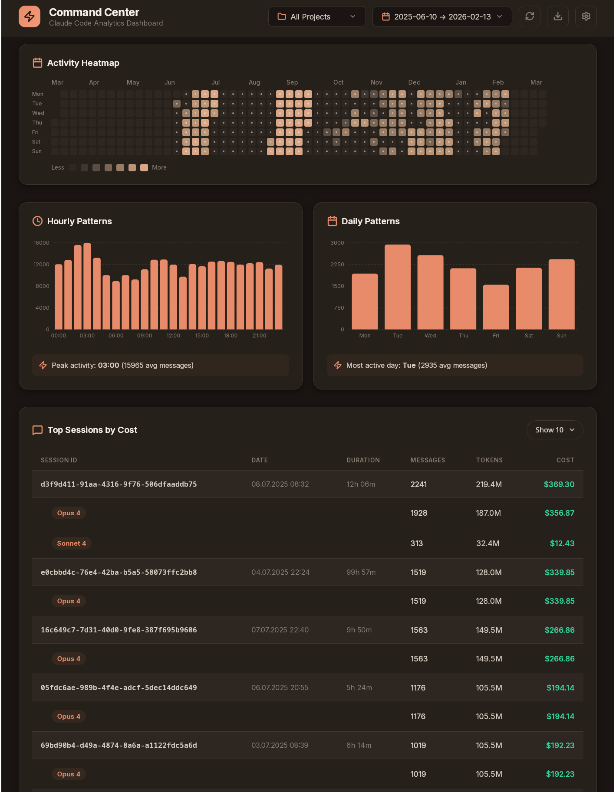

`command-center` (GitHub: `hipotures/command-center`, grudzień 2025–styczeń 2026, Python) rozwiązuje inny problem: chciałem wiedzieć, ile naprawdę kosztuje moja praca z Claude Code i jak te koszty rozkładają się w czasie i między projektami.

Narzędzie wczytuje surowe logi z sesji Claude Code, odfiltrowuje duplikaty i zapisuje ustandaryzowane wpisy do SQLite. Agregacja godzinowa i dzienna pozwala generować raporty szybko, bez skanowania całej historii przy każdym uruchomieniu. Wizualizacje renderuję przez Pillow jako PNG: mapa cieplna aktywności (w stylu wykresu wkładu GitHub, ale dla tokenów), ranking modeli, metryki efektywności buforowania, podstawowe podsumowania. Raport mogę wyświetlić bezpośrednio w terminalu – nie potrzebuję otwierać przeglądarki.

Kilka obserwacji z danych, które zebrałem:

Koszty są silnie skoncentrowane. Kilkanaście procent sesji generuje większość całkowitych wydatków. To zazwyczaj te sesje, gdzie pracowałem z bardzo długim kontekstem lub gdzie było dużo iteracji (model poprawiał to, co wcześniej zepsuł). Sprawny `StepByStep.md` napisany przed startem kodowania to dosłownie pieniądze zaoszczędzone na kosztach refaktoryzacji.

Efektywność cache jest widoczna i mierzalna. Po wdrożeniu prompt cachingu przy stałych prefiksach (system prompt, definicje architektury, reguły jakości) koszt per sesja spadł. Konkretnych liczb nie podaję, bo zależą od projektu i struktury promptów – ale rząd wielkości to kilkadziesiąt procent oszczędności przy sesjach z dużym stałym kontekstem.

Prototyp Tauri (Rust + React/TypeScript) jako desktopowy panel command-center: budowałem go jako ćwiczenie z frameworkiem Tauri, który potem użyłem w `any-item`. Panel desktopowy wygodnie agreguje dane z wielu projektów i prezentuje je w aplikacyjnej formie – ale jako samodzielne narzędzie nie jest niezbędny, bo wersja CLI i PNG są funkcjonalnie wystarczające.

### 2.4 scriptoza

`scriptoza` (GitHub: `hipotures/scriptoza`, listopad 2025–luty 2026, Python) to nie jest jeden projekt – to kolekcja małych narzędzi, które rozwiązują uciążliwe, powtarzalne problemy wokół pracy z plikami i narzędziami AI.

Geneza jest prosta: po kilku miesiącach intensywnej pracy z AI mam terabajty plików wideo z różnych kamer, których nazwy są chaosem (timestamp systemowy, lub cokolwiek kamera wymyśliła), i kilkanaście małych skryptów porozrzucanych po różnych miejscach. Scriptoza to próba wprowadzenia porządku w obydwu wymiarach.

Filozofia jest prosta: małe, niezależne skrypty zamiast monolitu, modularność jako wartość, dodawanie nowego skryptu tylko kiedy realnie oszczędza czas. Rich jako warstwa UI terminala sprawia, że operacje na tysiącach plików mają czytelne postępy i podsumowania. YAML do konfiguracji, jeśli reguły są złożone lub chcę je wersjonować.

### 2.5 Wzorzec pracy: sprint vs utrzymanie

Dane z gitiary pokazują jasny wzorzec: większość projektów jest budowana w intensywnych sprintach trwających od trzech do dziesięciu dni, z wyraźnym szczytem aktywności na początku, po którym następuje albo faza stabilizacji (kilka tygodni spokojnej pracy nad detalami i bugfixami), albo cisza (projekt jest domknięty).

Projekty, które żyją dłużej, mają inne wzorce. `37degrees` – cztery miesiące aktywności – ma trzy wyraźne fale intensywności z pauzami między nimi. To odpowiada naturze projektu: pipeline produkcji treści nie ma jednego „wydania” – ma seryjne iteracje nad kolejnymi materiałami. `scriptoza` – trzy miesiące – ma regularną, niską aktywność z kilkoma intensywniejszymi tygodniami. To projekt, który rośnie organicznie w odpowiedzi na nowe potrzeby.

Argument za świadomym zamykaniem projektów: AI obniżył koszt startowania projektu do prawie zera. To zmienia rachunek decyzyjny. Wcześniej zaczęcie nowego projektu wymagało znacznych zasobów – czasu na przygotowanie podstaw, powtarzalnych elementów, konfigurację CI itd. Teraz te koszty są minimalne. To jednak nie oznacza, że każdy projekt powinien żyć wiecznie. Utrzymanie wciąż jest ludzką robotą. Każdy projekt, który żyje, wymaga uwagi przy aktualizacjach zależności, przy integrowaniu z nowymi narzędziami, przy debugowaniu brzegowych przypadków. Świadome zamknięcie projektu (oznaczenie jako „done”, dobry README opisujący aktualny stan, logi wyłączone) jest lepsze niż zostawianie go „w połowie” z myślą „może kiedyś wrócę”.

Jest też kwestia synchronizacji rytmu pracy z charakterystyką projektu. Kilka projektów w moim portfolio ma bardzo specyficzne wzorce aktywności, które nie są przypadkowe – wynikają z natury tego, co budują. `mlarena` i `mdm` są aktywne, kiedy robię Kaggle. `37degrees` jest aktywny, kiedy produkuję materiały – kiedy nie produkuję, projekt śpi. `scriptoza` dostaje nowe skrypty, kiedy napotykam nowy powtarzalny problem.

Ta obserwacja prowadzi do wniosku, który jest bardziej ogólny: portfolio projektów zbudowanych w vibe coding działa jak ekosystem, nie jak lista zadań do ukończenia. Projekty mają różne czasy życia, różne wzorce aktywności, różne role. Część z nich to infrastruktura, która działa cicho w tle. Część to narzędzia, które są aktywne w konkretnych kontekstach pracy. Część to eksperymenty, które dostarczyły wartości edukacyjnej i mogą teraz spać. Zarządzanie tym ekosystemem – wiedza, kiedy inwestować, kiedy utrzymywać, kiedy archiwizować – jest częścią kompetencji Vibe Operatora.

Jedna liczba, która porządkuje ten obraz: z osiemnastu projektów sześć jest aktywnie rozwijanych, osiem jest w trybie „utrzymania i używania”, cztery są domknięte jako eksperymenty lub prototypy.

---

## SEKCJA III: PORTFOLIO – 18 PROJEKTÓW, 4 KATEGORIE

Zamiast listy repozytoriów – mapa. Cztery wymiary: dziedzina (czym jest projekt), interfejs (jak z nim rozmawiasz), rola AI w projekcie (Core = AI jest funkcją produktu, Integration = AI przez MCP/proces pomocniczy, Meta = projekt mierzy użycie AI, Assist = AI głównie jako współautor kodu) i chronologia (od najstarszego).

| Projekt | Dziedzina | Interfejs | Język(i) | Rola AI | Po co |
|---|---|---|---|---|---|
| sonus | Media | Cloud | Py, Terraform | Core | Transkrypcja + diaryzacja jako system cloudowy |
| quaternion-julia | Creative | Web | JS | Assist | WebGL eksplorator 3D fraktali Julii, VR |
| tklivetracker | Media | Web | Py | Assist | Monitoring i nagrywanie TikTok Live 24/7 |
| mcp-midi-virtual-server | Infra | CLI | Py | Integration | Most MCP→MIDI do aplikacji muzycznych |
| ProfundaImmersio | Creative | VR | TS | Assist | Tetris w WebXR/A-Frame na Meta Quest |
| minotaur | ML | CLI | Py | Assist | Eksploracja cech w ML: MCTS |
| mdm | ML | CLI | Py | Assist | Menedżer zbiorów danych: porządek w danych, typy, eksport |
| HSOF | ML | CLI | Julia | Assist | 3-stage selekcja cech: GPU filter → MCTS → eval |
| 37degrees | Media | CLI | Py | Core | Pipeline pionowych video z AI: książki → TikTok |
| todoit | Prod | CLI | Py | Integration | Zaawansowany menedżer zadań z MCP/CLI |
| mlarena | ML | CLI | Py | Assist | Framework Kaggle: pipeline od EDA do zgłoszenia |
| scriptoza | DevTools | CLI | Py, sh | Assist | Różne skrypty, głównie do zarządzania danymi AV |
| command-center | DevTools | CLI | Py | Meta | Raporty kosztów/użycia tokenów AI |
| vbc | Media | TUI | Py | Assist | Wsadowa kompresja AV1, architektura zdarzeniowa |
| any-item | Prod | Desktop | Rust, TS, Py | Core | Asystent ogłoszeń: zdjęcia → listing |
| gitiary | DevTools | Web | TS | Meta | Pulpit aktywności w repozytoriach |
| identity | Creative | Desktop | Rust | Assist | Fork: rozwinięcia kodu pod własne potrzeby |
| calendar-mcp | Prod | CLI | Py | Integration | Fork: MCP do kalendarza, rozwinięcia kodu pod własne potrzeby |

---

### GRUPA A: ML engineering jako system, nie notebook

Połowa moich projektów ML powstała w ciągu czterech tygodni – lipiec 2025. To był intensywny okres, napędzony konkursami Kaggle. Wspólny mianownik tych czterech projektów to zarządzanie danymi, selekcja cech, reprodukowalność eksperymentów, iteracja. AI znacznie przyspieszyło tempo tej pracy – ale nie poprzez wyeliminowanie trudnych decyzji, tylko poprzez obniżenie kosztu eksperymentowania z różnymi podejściami.

#### minotaur

`minotaur` (GitHub: `hipotures/minotaur`, czerwiec–lipiec 2025, projekt zakończony, Python) powstał przy konkursie Kaggle Playground Series S5E6 – „Predicting Optimal Fertilizers”. Problem: przy intensywnym feature engineeringu przestrzeń możliwych transformacji jest za duża na ręczne testowanie. Normalnie sprawdzasz kilkanaście pomysłów, wybierasz te, które działają, i idziesz dalej. Jeśli przestrzeń ma tysiące możliwych operacji – potrzebujesz systematyczniejszego podejścia.

Rozwiązanie: traktuj kolejne operacje na kolumnach jak drzewo decyzji. Monte Carlo Tree Search jako framework przeszukiwania: selekcja (UCB1 do balansu eksploracji i eksploatacji), ekspansja (nowa operacja na istniejącym zbiorze cech), symulacja (szybka ocena wartości nowego zbioru), propagacja (aktualizacja wartości ścieżki). AutoGluon do automatycznej oceny kandydatów – wystarczająco szybki, żeby symulacja była praktyczna, wystarczająco dobry, żeby rankingi były informacyjne.

Stack: Python 3.12, SQLite + SQLAlchemy + DuckDB do warstwy danych, AutoGluon jako ewaluator, LightGBM/XGBoost/CatBoost jako modele bazowe, PyTorch opcjonalnie tam gdzie miało sens. DuckDB do analiz kolumnowych na generowanych zbiorach – jest wyraźnie szybszy niż pandas przy operacjach agregujących na szerokich tabelach.

Operacje cech podzielone na bloki: statystyki (mean, std, percentyle), binning (różne strategie), ranking, kategorie (encoding), czas (jeśli kolumna datowa), domenowe rozszerzenia per konkurs. Dzięki temu przestrzeń przeszukiwania jest mierzalna i rozszerzalna: dodajesz nowy blok operacji, nie przepisujesz algorytmu.

Kilkudniowy sprint na przełomie czerwca i lipca 2025. Równolegle budowałem algorytm MCTS i warstwę danych. Środkowa faza: wydajność – ograniczanie kosztów generowania cech, uspójnianie pipeline’u. Końcówka: konfiguracja, testy, dokumentacja.

Jeden wniosek, który warto zabrać: MCTS jako framework decyzyjny ma sens wszędzie tam, gdzie przestrzeń jest za duża na brute-force, a funkcja oceny jest kosztowna, ale możliwa. To nie jest narzędzie specyficzne dla gier – to ogólny sposób na systematyczne eksplorowanie przestrzeni decyzji.

#### mdm
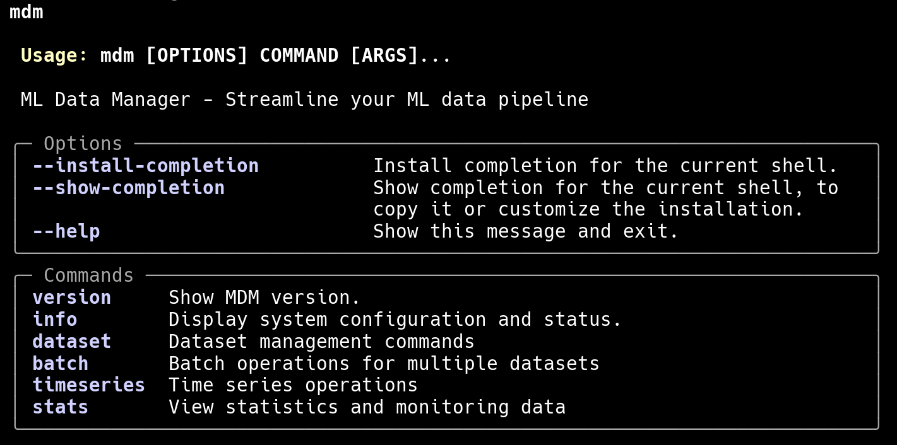

`mdm` (GitHub: `hipotures/mdm`, lipiec 2025, projekt zakończony, Python) rozwiązuje problem, który mają wszyscy ML-inżynierzy, którzy robią więcej niż jeden projekt: chaos danych. Różne wersje tego samego datasetu, bez etykiet, kiedy i po co zostały przetransformowane, bez informacji o typach kolumn, bez profilowania jakości. Po trzecim projekcie zaczynam spędzać więcej czasu, szukając „skąd wziąć ten dataset, który był w tamtym projekcie”, niż robiąc faktyczne modelowanie.

MDM to biblioteka stawiająca na CLI do rejestracji, tagowania i wyszukiwania datasetów. Interfejs: Typer + Rich, żeby terminalne przeglądanie zbiorów i ich metadanych było wygodne. Warstwa danych: abstrakcja backendu z obsługą SQLite (domyślna, lokalna, przenośna), DuckDB (do analiz), PostgreSQL (kiedy potrzebujesz środowiska serwerowego). Modele i walidacja w Pydantic v2 – spójne API zarówno w CLI, jak i przy użyciu jako biblioteka.

Automatyczne wykrywanie typów kolumn i kodowania plików przy rejestracji. Rozpoznawanie struktur z konkursów Kaggle (szybki start bez konfiguracji). Tagowanie i wyszukiwanie. Profilowanie przez ydata-profiling plus własne metryki podstawowe. Feature engineering jako osobny moduł, żeby nie mieszać eksperymentów z kodem rejestracji.

Krótki, intensywny sprint. Równolegle: fundamenty (rejestracja, backendy, konfiguracja) i ergonomia terminala. Stabilizacja: walidacja wejścia, obsługa błędów, metadane i statystyki kolumn. Jakość: pytest + ruff + mypy + black od początku, żeby szybkie iteracje nie rozbijały kontraktów.

#### MLArena
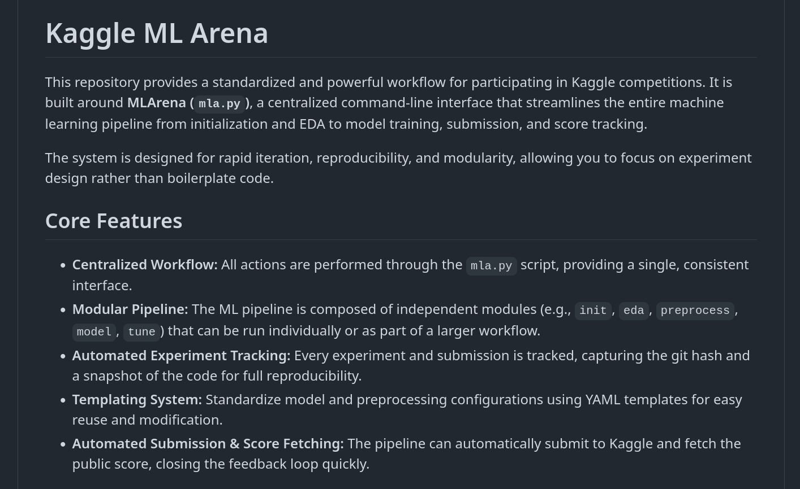

`mlarena` (GitHub: `hipotures/mlarena`, listopad 2025–styczeń 2026, projekt zakończony, Python) to próba odpowiedzi na pytanie: ile czasu spędza się przy każdym konkursie Kaggle na powtarzaniu tych samych czynności? Dużo. mlarena to framework, który to standaryzuje.

Jedno CLI do wszystkiego: inicjalizacja projektu, EDA (ydata-profiling), preprocessing, trening, predykcja, zgłoszenie, pobranie publicznego wyniku. Stack: pandas/numpy dla danych, polars/pyarrow dla szybkich formatów kolumnowych, AutoGluon jako domyślna ścieżka modelowania, XGBoost/LightGBM/CatBoost alternatywnie, Optuna do tuningu, MCTS do inżynierii cech.

Konfiguracja w YAML z profilem per konkurs. Cienki interfejs CLI → rdzeń orkiestracji → warstwa per-konkurs → śledzenie eksperymentów. Wznawianie przerwanych przebiegów. Kolejka do długich przebiegów wsadowych. Automatyczne zgłoszenie do Kaggle API i pobranie publicznego wyniku – pętla informacji zwrotnej zamknięta bez ręcznego klikania.

Prace przez grudzień i styczeń – dwa miesiące, bo to nie jest projekt tygodniowego sprintu. Framework, który ma przeżyć wiele konkursów, wymaga inwestycji w architekturę trudną do rozłożenia na mniejsze etapy.

#### HSOF

`HSOF` (GitHub: `hipotures/HSOF`, lipiec 2025, projekt zakończony, Julia) to trzyetapowy pipeline selekcji cech: filtr GPU (szybkie statystyki na CUDA.jl), MCTS z metamodelem Flux (sieć gęsta + mechanizm uwagi do przewidywania jakości podzbioru), twarda ewaluacja na MLJ (XGBoost z GPU + klasyczne modele).

Dlaczego Julia? Kilka konkretnych powodów: Julia ma natywną integrację z CUDA przez CUDA.jl – nie przepisuję kodu na C++/CUDA, mam Juliową składnię. Flux.jl do metamodelu – dobre API, bez zbędnej infrastruktury jak w PyTorchu. MLJ jako meta-framework ML – jednolity interfejs do wielu modeli tabularnych, wygodny do systematycznej ewaluacji. Połączenie: szybkość obliczeń GPU w czytelnym kodzie z dobrą integracją ML.

Konfiguracja w YAML, dane wczytywane z SQLite do DataFrames. Etap 1: CUDA.jl do korelacji, wariancji, statystyk zależności – redukuje przestrzeń z tysięcy do setek cech. Etap 2: MCTS z metamodelem Flux – GPU, równoległość, kontrola pamięci i rozmiaru przestrzeni poszukiwań. Etap 3: MLJ + XGBoost (GPU) – twarda ewaluacja finalnych kandydatów.

Architektura modułowa: loader, moduły etapów 1-3, warstwa narzędzi. Każdy etap testowany niezależnie. Wyniki do JSON – porównywanie przebiegów, śledzenie czasów etapów.

Intensywny kilkudniowy sprint w połowie lipca 2025. Końcówka: parametryzacja, testy regresji, ewaluacja end-to-end.

---

### GRUPA B: Systemy medialne i content pipeline

Cztery projekty, które łączy jedno: tworzą lub przetwarzają treści multimedialne, muszą działać niezawodnie w czasie i mają cechy asynchroniczne, których prosta aplikacja CRUD zwykle nie ma. Wspólny mianownik techniczny: architektura zdarzeniowa, niezawodne ponowienia, obserwowalność, zarządzanie zasobami zewnętrznymi (GPU, chmura, API zewnętrznych serwisów).

#### sonus

`sonus` (GitHub: `hipotures/sonus`, luty 2025, projekt zakończony, Python + Terraform) był moim pierwszym dużym projektem zbudowanym w vibe coding. Opisałem go wcześniej w kontekście historycznym – tu chcę skoncentrować się na architekturze i lekcjach.

Problem: Google Meet nie transkrybował po polsku (stan na luty 2025). Można było zapisać spotkanie jako plik na Google Drive. Potrzebowałem: automatycznej transkrypcji z rozpoznaniem mówców (diaryzacja), możliwości generowania podsumowania na podstawie tekstu.

Architektura zdarzeniowa: dwa niezależne komponenty. Activator (skaner źródeł → Pub/Sub): cyklicznie skanuje źródła plików (Google Drive, GCS, FTP), dla każdego pliku tworzy JSON z metadanymi i wrzuca do kolejki Pub/Sub. Zabezpieczenie przed dublowaniem pracy na tych samych plikach. Transcriber (worker): pobiera JSON z Pub/Sub, waliduje wejście, uruchamia pipeline WhisperX + pyannote.audio/SpeechBrain, zapisuje wyniki w lokalizacji pliku źródłowego.

GCP: Cloud Run dla obydwu komponentów (niska prognozowana intensywność użycia = Cloud Run tańszy niż GKE), Pub/Sub do kolejki, GCS do storage, Drive API do dostępu do plików. Terraform/OpenTofu do całej infrastruktury. Docker + Cloud Build do CI/CD.

Sprint: piątek po południu do poniedziałku, ~40 godzin.  Problemy: diff mode w Cline przy długich plikach przełączał się na pełną aktualizację i urywał kod – trzeba było cofać. Prompt cache na Vertex AI nie był dostępny w czasie budowy – pojawiło się kilka dni po zakończeniu, oszacowałem że obniżyłoby koszty ~4x. Kilka refaktoryzacji kodu. Generowanemu plikowi `StepByStep.md` (o3, ~2500 linii, kompletna ścieżka budowy) przypisuję większą część tego, że projekt wyszedł w trzy dni a nie trzy tygodnie.

Wynik: ~5000 linii Python, ~1500 linii Terraform, ~2500 linii StepByStep.md, ~2500 linii innych plików .md.

#### 37degrees
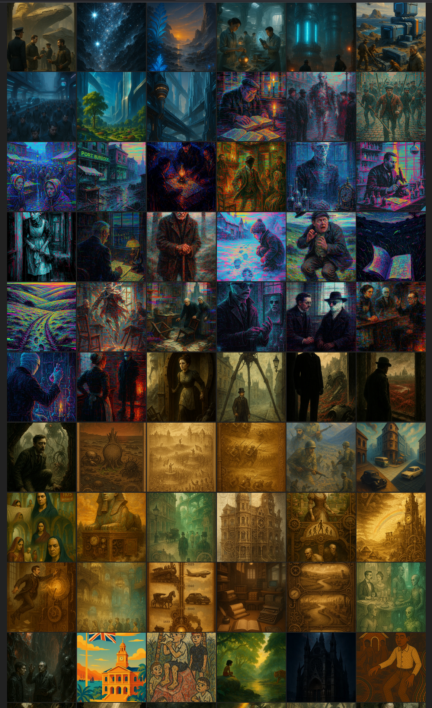

`37degrees` (GitHub: `hipotures/37degrees`, lipiec–listopad 2025, projekt zawieszony, Python) to największy projekt pod względem łącznego czasu pracy. Nie ma jednego „wydania” – to pipeline produkcji, który działa ciągle.

Geneza: chciałem promować klasyczną literaturę polskiej młodzieży (i nie tylko polskiej) przez krótkie, pionowe formaty wideo na TikTok/Instagram. Kamera wchodzi w głąb danego tytułu – ciekawostki, konteksty historyczne, symbole, dlaczego to ma sens czytać w 2025 roku. Każdy „odcinek” opisany w YAML: metadane, cel, format, parametry produkcji.

Pipeline: YAML odcinka → scenariusz scen (ręcznie lub automatycznie z szablonów promptów) → opracowanie badawcze (multi-agentowy system siedmiu–ośmiu Claude Code sub-agentów: facts-hunter, symbol-analyst, culture-impact, polish-specialist, youth-connector, bibliography-manager, source-validator) → prompty do generowania obrazów + wybór stylu graficznego → generowanie obrazów (InvokeAI lub ComfyUI przez pluginową warstwę generatorów) → audio NotebookLM (wielojęzyczne dialogi, 9 języków) → montaż MoviePy/FFmpeg → statyczny HTML galerii.

NotebookLM do audio: generuję wielojęzyczne nagrania w formatach dialogowych. Pobieranie audio z NotebookLM zautomatyzowałem – Playwright steruje przeglądarką, pobiera pliki, porządkuje je w strukturze katalogowej.

Trzy fale intensywności przez cztery miesiące. Sprint startowy latem: architektura, warstwa wtyczek, podstawowy pipeline. Fale jesienne: automatyzacje audio, usprawnienia pipeline’u, rozszerzenie o nowe formaty materiałów. Ostatni intensywny etap zakończył się w listopadzie.

Po zrealizowaniu około 90% projektu okazało się, że najsłabszym elementem całego pipeline’u jest warstwa audio. Generator NotebookLM błędnie rozpoznawał rodzaj postaci, co prowadziło do niewłaściwej fleksji, a do tego dochodziły drobniejsze błędy językowe i problemy z odmianą skrótów, np. „CIA” czytane jako „cija” zamiast „siː aɪ eɪ”. Szukając wyjścia, zacząłem sprawdzać ElevenLabs, ale zatrzymałem się na etapie dokumentacji i integracji. W efekcie projekt, który był już niemal domknięty, utknął tuż przed końcem. Dziś widzę to raczej jako sygnał, że potrzebne jest nie punktowe poprawianie błędów, lecz przeprojektowanie tej części pipeline’u i uniezależnienie jej od ograniczeń Claude Code, który działa tu przy znacznie ostrzejszych limitach tokenów.

#### tklivetracker
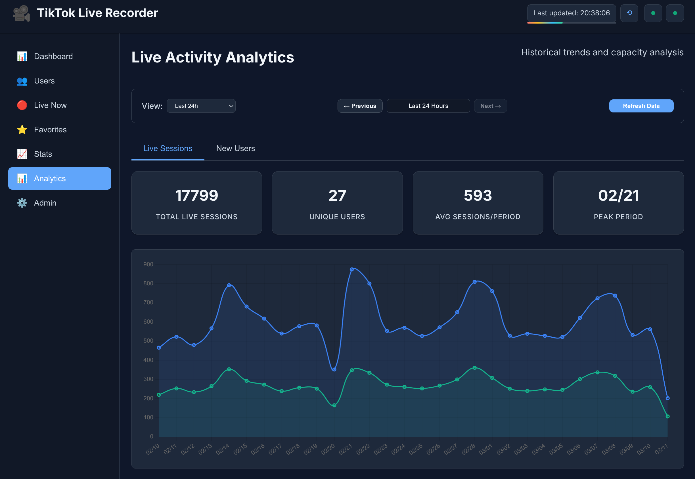

`tklivetracker` (GitHub: `hipotures/tklivetracker`, kwiecień–lipiec 2025, projekt aktywny, Python) rozwiązuje problem, który jest trudny do opisania, ale natychmiastowo rozumiany przez każdego, kto go miał: ręczne pilnowanie transmisji live jest niemożliwe przy wielu użytkownikach.

Architektura: asyncio do monitorowania wielu kont równolegle z adaptacyjną częstotliwością sprawdzania. FFmpeg do nagrywania jako osobne procesy robocze. Nadzorca z health-checkami i automatycznymi restartami. Zabezpieczenia: blokada jednoczesnego uruchamiania wielu instancji, limity zasobów przy równoległym nagrywaniu wielu transmisji.

Dostęp do transmisji przez cookies z przeglądarki – nie utrzymuję tokenów ręcznie. Flask + Jinja2 + SSE jako webowy monitor z podglądem statusów, listą użytkowników, analityką aktywności w czasie rzeczywistym. Chart.js do historycznych wizualizacji. Opcjonalne powiadomienia przez Telegram (Pyrogram).

Tryb Selenium (gałąź `selenium-refactor`): kiedy detekcja HTTP jest mniej stabilna lub TikTok zmienia API. Ta gałąź jest moją aktualną wersją produkcyjną.

Aktywność: intensywny start (kwiecień 2025), potem kilka tygodni stabilizacji niezawodności, domknięcie w lipcu, uporządkowany w marcu 2026. 

Projekt nie jest publicznie dostępny ze względu na zastosowanie biblioteki, która została mocno zintegrowana/przerobiona pod moje potrzeby.

#### vbc
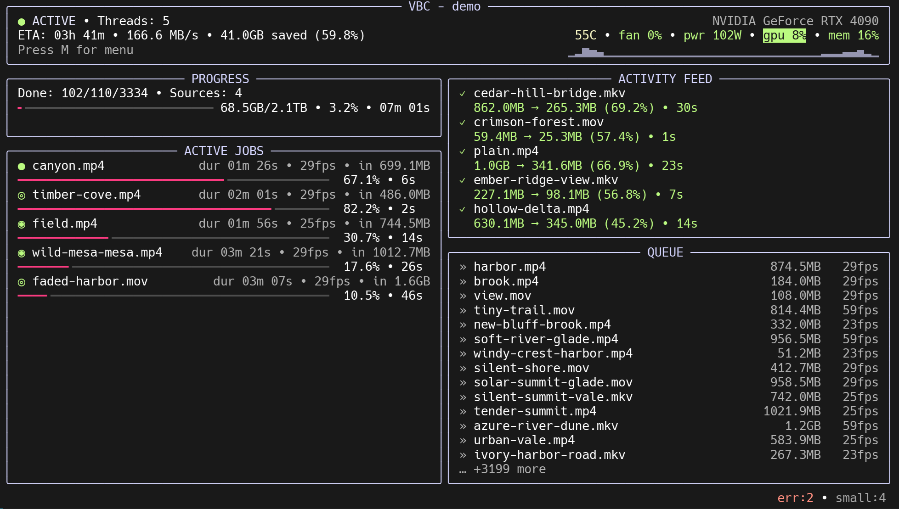

`vbc` (GitHub: `hipotures/vbc`, grudzień 2025–luty 2026, projekt aktywny, Python) to odpowiedź na prosty problem: mam terabajty materiałów z kamer w formatach H.264/H.265 i chcę je skompresować do AV1 bez utraty jakości, automatycznie, na tysiącach plików, z możliwością wznowienia po przerwaniu.

Clean architecture w projekcie CLI: domena z modelami i zdarzeniami, infrastruktura z adapterami do narzędzi zewnętrznych (FFmpeg, ExifTool), UI (Typer + Rich TUI). Event bus między komponentami – pipeline kompresji i interfejs są niezależnie rozwijalne i niezależnie testowalne. Wznawialna kolejka: jeśli przerwie się po 500 z 1000 plików, nie zaczynam od nowa.

FFmpeg z wyborem enkodera: NVENC (GPU, szybko, mniej kontroli nad jakością), SVT-AV1 (CPU, wolno, lepsza jakość dla archiwów). ExifTool do odczytu i zachowania metadanych. Opcjonalne monitorowanie GPU przez nvtop – wąskie gardła widoczne natychmiast.

Pytest dla logiki domenowej. MkDocs do dokumentacji. Pydantic do walidacji konfiguracji – zero tolerancji dla błędnych parametrów na początku sesji kompresji.

Dlaczego clean architecture w narzędziu dla jednej osoby? Bo pipeline kompresji i interfejs muszą być niezależnie testowalne. Bo w przyszłości może chcę podmienić FFmpeg na coś innego. Bo architektura zdarzeniowa sprawia, że pasek postępu i logika kompresji nie mają żadnej zależności – postęp jest emitowany jako zdarzenie, a konsument zdarzenia może wyświetlić go, jak chce.

Intensywny sprint grudzień–styczeń, stabilizacja przez kilka tygodni, domknięcie w lutym, dalsze zmiany w marcu.

Projekt wyrósł ze skryptu `scriptoza` do samodzielnego kodu. Kod ma kilka zabezpieczeń przed przypadkowym usunięciem plików źródłowych bez potwierdzenia udanej kompresji. Używam go prawie codziennie, powoli kompresując bibliotekę wideo z ostatnich 15 lat.

---

### GRUPA C: Produktywność, MCP i integracje

Cztery projekty, które łączy warstwa protokołu i integracji. MCP jako zmiana jakościowa: model nie tylko generuje kod, ale też *wykonuje* akcje w systemie. Różnica jest zasadnicza – to przejście od asystenta do agenta.

#### todoit
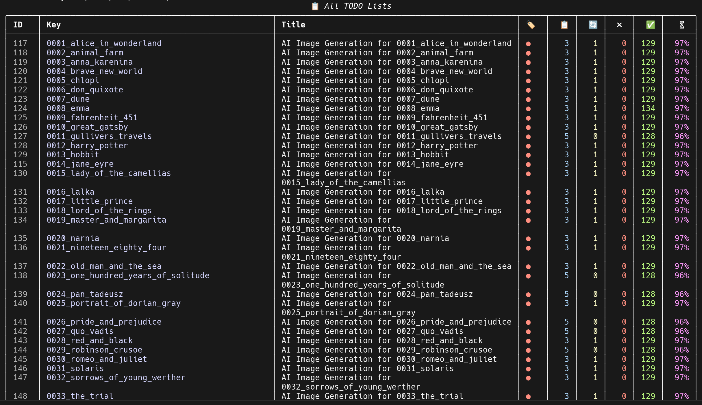

`todoit` (GitHub: `hipotures/todoit`, sierpień–październik 2025, projekt zakończony, Python) zaczął się od prostej potrzeby: chciałem menedżera zadań, który rozumie zależności między zadaniami i nadaje się jako interfejs dla asystenta AI. W sierpniu 2025 jedynym agentem programowania AI, który miał listę TODO, był Claude Code; dzięki MCP/CLI mogłem używać todoit w Codexie i Gemini.

Większość menedżerów zadań to listy rzeczy do zrobienia. `todoit` to system zarządzania pracą z modelem domenowym: listy, elementy, podzadania, zależności między zadaniami z zabezpieczeniem przed pętlami. Algorytm wyboru „następnego zadania” bierze pod uwagę statusy i blokady – mówi mi, które zadanie powinienem robić teraz, uwzględniając, co blokuje co.

System właściwości (klucz–wartość) dla list i elementów – przechowuję konfiguracje i stan automatyzacji bez rozbudowy schematu. Tagi z kodowaniem kolorów. Historia zmian – dziennik zmian.

MCP: funkcje zarządzania listami, elementami, zależnościami i raportami jako narzędzia MCP. Asystent może tworzyć zadania, aktualizować statusy, pobierać co jest do zrobienia – to rozmowa jako API do planowania. CLI na Click + Rich równolegle – te same operacje bez AI.

SQLite + SQLAlchemy + Pydantic. Import/eksport w formatach tekstowych. Pytest dla logiki zależności – musi być testowana, bo błąd w algorytmie blokad jest subtelny.

Kilkutygodniowy sprint w sierpniu. Trzon w pierwszych tygodniach: baza, modele, hierarchia, zależności, integracja MCP. Krótkie sesje stabilizacji przez wrzesień–październik.

Task manager wyrósł z projektu `37degrees`, z prostej bazy SQLite do uniwersalnego narzędzia MCP/CLI.

#### calendar-mcp

Fork `calendar-mcp` (Python, MCP do kalendarza) to najprostszy z czterech projektów tej grupy, ale koncepcyjnie istotny. Asystent, który może *zapisać* zdarzenie w kalendarzu, różni się jakościowo od asystenta, który *sugeruje*, żebym zapisał zdarzenie w kalendarzu. Różnica jest mała technicznie – jedno wywołanie MCP – a duża praktycznie: nie muszę kopiować i przeklejać.

MCP to „USB-C dla AI” (opis z dokumentacji Anthropic) – raz implementujesz protokół w kliencie, odblokowujesz ekosystem integracji. Zamiast budować dedykowaną integrację dla każdego modelu i każdego serwisu, budujesz jeden serwer MCP i każdy klient, który zna protokół, może z niego korzystać.

Dodałem do tego narzędzia kilka modyfikacji na swoje potrzeby.

#### any-item
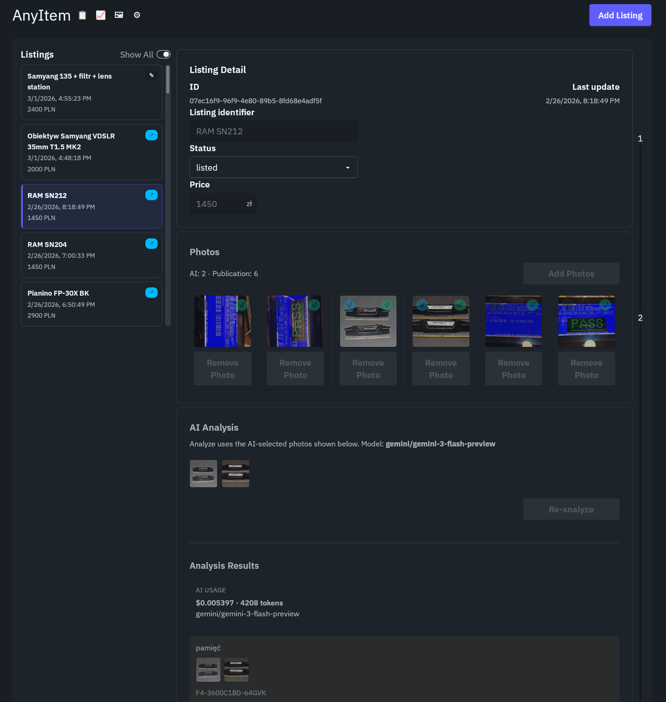

`any-item` (GitHub: `hipotures/any-item`, luty 2026, projekt rozwijany, Rust/Tauri + TypeScript/SvelteKit + Python) to najbardziej wielojęzyczny projekt w portfolio i dobry przykład tego, co się dzieje, gdy masz trzy różne ekosystemy do połączenia.

Problem: zdjęcia produktu → gotowy szkic oferty na platformę sprzedażową (OLX, Allegro). Analiza zdjęć przez VLM (model językowo-wizyjny), generowanie tytułu i opisu, mapowanie na pola formularza, opcjonalne automatyczne wypełnienie formularza przez CDP.

Architektura trójwarstwowa: Tauri 2 (Rust) jako natywne okno desktopowe i klej między warstwami. SvelteKit/TypeScript jako warstwa interfejsu (natywne okno Tauri renderuje interfejs webowy). Pythonowy proces pomocniczy do zadań AI (LiteLLM + google-genai do analizy obrazów i generowania treści, Pillow do przygotowania zdjęć).

Dlaczego pythonowy proces pomocniczy zamiast Rusta do AI? Dlatego że ekosystem AI w Pythonie (LiteLLM, google-genai, biblioteki VLM) jest dojrzały i stabilny. W tym wzorcu Tauri uruchamia proces Pythona, komunikuje się z nim przez proces podrzędny, Python wykonuje zadania AI i zwraca JSON. Wymiana dostawcy modeli oznacza zmianę jednej linii konfiguracji w tym procesie pomocniczym.

Clean architecture: modele domenowe w Rust (ogłoszenia, historia, koszt), adaptery do bazy (SQLite + sqlx), warstwa Tauri jako koordynator. Tauri wystawia komendy dla interfejsu, mapuje dane do JSON, wstrzykuje zależności – ale nie przenosi logiki biznesowej do warstwy interfejsu.

Automatyzacja formularzy przez Chrome DevTools Protocol (CDP): sterowanie przeglądarką do wypełniania formularzy OLX.

Historia zmian w SQLite – dziennik zmian z możliwością powrotu do poprzednich wersji szkicu. Identyfikacja zdjęć przez hash – ograniczenie duplikatów, porządek w magazynie plików.

Intensywny sprint w lutym 2026. Równolegle: szkielet aplikacji, baza, integracja AI, kluczowe ekrany. Końcówka: refaktoryzacje granic architektury, automatyzacja OLX, dokumentacja.

Projekt zrealizowany na własne potrzeby, używam.

#### mcp-midi-virtual-server

`mcp-midi-virtual-server` (kwiecień–czerwiec 2025; projekt to raczej wersja demo, do rozwoju w przyszłości; Python, FastMCP) to projekt, który na początku brzmi jak hobby, a po chwili zastanowienia jest przykładem na szersze twierdzenie: MCP otwiera drzwi do świata fizycznego.

Cel: sterowanie aplikacją muzyczną (MuseScore, DAW) komunikatami MIDI z poziomu narzędzi MCP. Powód: uczę się grać na pianinie od marca 2022 roku i interesuje mnie automatyzacja pewnych aspektów pracy z notacją muzyczną i generowaniem sekwencji.

Stack: FastMCP (biblioteka do budowania serwerów MCP w Pythonie), asyncio, Starlette/Uvicorn, python-rtmidi, SSE/JSON-RPC. Narzędzia MCP: Note On, Note Off, Control Change, sekwencje. Walidacja zakresów kanałów i wartości zgodnie z MIDI spec. Asynchroniczne planowanie zdarzeń w sekwencji – nie blokuję serwera na czas między nutami.

Intensywny sprint pod koniec kwietnia 2025. Krótka sesja w czerwcu 2025 do dopięcia dokumentacji.

---

### GRUPA D: Eksploracja, DevTools i projekty kreatywne

Sześć projektów o bardzo różnych charakterach. Trzy DevTools (gitiary, command-center, scriptoza) zostały omówione szczegółowo w Sekcji II – tu krótsze odniesienie z perspektywy kategorii. Trzy projekty kreatywne/eksploracyjne: fractal explorer, ProfundaImmersio, identity.

#### quaternion-julia-fractal-explorer
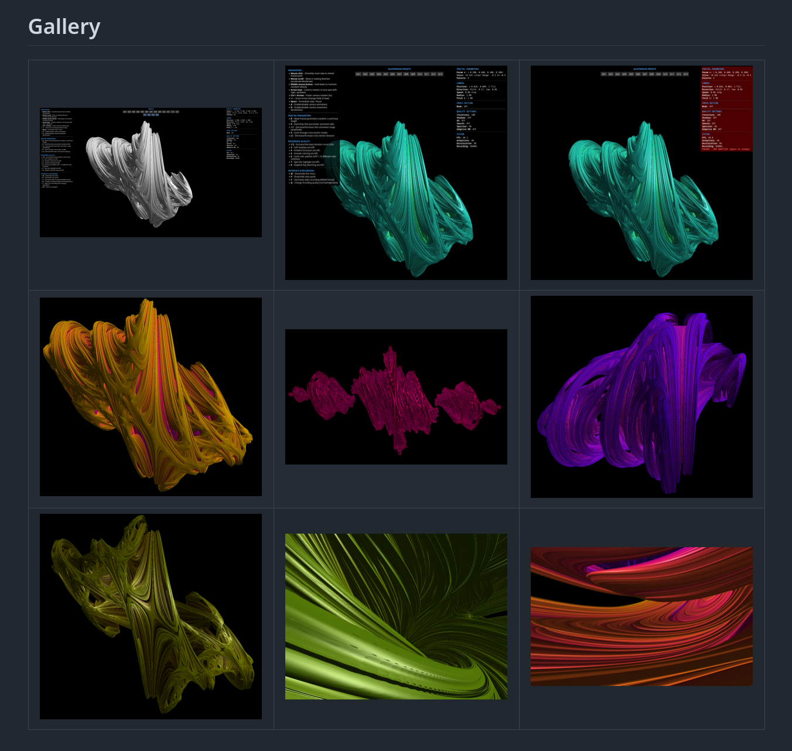

`quaternion-julia-fractal-explorer` (GitHub: `hipotures/quaternion-julia-fractal-explorer`, kwiecień–czerwiec 2025, testy w VR 2026, JavaScript/WebGL) to interaktywny trójwymiarowy eksplorator fraktali Julii w ujęciu quaternionowym.

Quaterniony to czterowymiarowe liczby zespolone. Fraktale Julii w quaternionach istnieją w 4D – żeby je zobaczyć w 3D, bierzesz przekrój. Każde cięcie pod innym kątem daje inny obraz. Eksplorator pozwala na płynne przemieszczanie się przez tę przestrzeń w czasie rzeczywistym.

Stack: JavaScript, WebGL, Three.js, Tweakpane. Renderer: shader fragmentów z ray marchingiem. Estymacja odległości do powierzchni fraktala (DEM – Distance Estimation Method). Ambient occlusion dla realizmu oświetlenia. Klikanie na punkt w kadrze = płynne przelecenie kamery do wybranego miejsca.

Presety parametrów (szybki start, znane interesujące miejsca). System „wycieczek” – nagrywaj i odtwarzaj przejścia. Rejestrator eksploracji jako wideo. UI zoptymalizowany pod nagrywanie (chowasz panele sterowania).

Statyczna aplikacja front-endowa, bez backendu, hosting gdzie chcesz.

Sprint startowy w kwietniu 2025. Powrót w czerwcu – przebudowa UI, dokumentacja, uproszczenia.

Dlaczego ten projekt? Robiłem podobny na studiach; jedna klatka generowała się kilka minut. Aktualnie w czasie rzeczywistym da się renderować w przeglądarce i na goglach VR (w trakcie testów).

#### ProfundaImmersio

`ProfundaImmersio` (GitHub: `hipotures/ProfundaImmersio`, maj–czerwiec 2025; proste demo, kiedyś do niego wrócę i może rozwinę w coś ciekawego; TypeScript/A-Frame/WebXR) to minimalistyczny VR Tetris na Meta Quest.

Pytanie, na które chciałem odpowiedzieć: jak klasyczna pętla rozgrywki działa w skali przestrzennej? Studnia z głębią, klocki opadające w trójwymiarowej przestrzeni, gracz w środku zamiast przed ekranem.

Stack: TypeScript, Vite, A-Frame/WebXR, js-yaml, PWA. Parametry rozgrywki w YAML – zmieniam rozmiary planszy, zestaw klocków, tempo gry bez przebudowy kodu. Architektura zdarzeniowa: komponenty A-Frame emitują zdarzenia, scena spina je w pętlę gry.

Podstawowa mechanika: pojawianie się nowych bloków, kolizje, osadzanie, czyszczenie warstw, przyspieszanie tempa. HUD z wynikiem. Najlepszy wynik lokalnie. Kontrolery VR zmapowane na akcje.

PWA: manifest i service worker – aplikacja zachowuje się jak natywna na Quest, działa w trybie offline.

#### identity

Fork `identity` (Rust, fork) to projekt, który wymaga najkrótszego opisu: fork istniejącej aplikacji desktopowej w Rust z kilkoma małymi modyfikacjami.

Do `vbc` potrzebowałem narzędzia do porównywania jakości kompresji, a `identity` dobrze nadawało się do tej roli. Zrobiłem więc fork istniejącej aplikacji i dopisałem kilka elementów, których brakowało mi w praktycznym użyciu. Potem spędziłem kilka tygodni na lepszym zrozumieniu metryk takich jak VMAF/NEG, PSNR i SSIM, ale koniec końców wróciłem do rozwiązania najprostszego i najtańszego w codziennej pracy.

---

## SEKCJA IV: WNIOSKI

### 4.1 Wzorce, które się powtarzają

Po roku budowania osiemnastu projektów kilka wzorców powtarzało się tak konsekwentnie, że nie traktuję ich już jako opcjonalnych dobrych praktyk. To raczej warunki konieczne, jeśli projekt ma działać dłużej niż demo.

**Infrastruktura do iteracji: skrypty, makra, szablony promptów.** Część pracy z AI polega na przygotowaniu właściwego kontekstu dla właściwego zadania. Szablony promptów dla powtarzalnych operacji (generowanie testów, pisanie dokumentacji, refaktoryzacja konkretnego wzorca) oszczędzają czas i zapewniają spójność.

**Twarde granice w krytycznych miejscach.** Testy tam, gdzie logika jest złożona (zależności w todoit, agregaty w gitiary, walidacja kolejki w vbc). Walidacja danych wejściowych tam, gdzie błędy propagują się trudno do debugowania (pipeline transkrypcji w sonus, feature engineering w minotaur). Nie potrzebuję 100% pokrycia testami – potrzebuję testów dokładnie tam, gdzie model AI ma największą szansę coś subtelnie zepsuć.

**Clean architecture nawet w projektach jednoosobowych.** Podział na domenę, infrastrukturę i UI to nie overengineering. To granica między „kodem, który można zmienić” a „kodem, który można tylko zastąpić”. W `vbc`: pipeline kompresji i interfejs TUI są niezależne przez event bus – mogę przepisać jedno bez ruszania drugiego. W `any-item`: logika domeny w Rust, adaptery w osobnych modułach – podmieniam backend storage bez zmiany modelu domenowego.

**YAML jako format konfiguracji.** Wersjonowanie, czytelność, możliwość modyfikacji bez dotykania kodu. Używam go w `37degrees` (opisy odcinków), `mlarena` (profile konkursów), `vbc` (parametry kompresji), `mcp-midi-virtual-server` (konfiguracja portów), `ProfundaImmersio` (parametry rozgrywki).

**Event-driven design w narzędziach z długim życiem.** `tklivetracker`, `vbc`, `37degrees` – wszystkie korzystają z wzorca, gdzie komponenty komunikują się przez zdarzenia, a nie przez bezpośrednie wywołania. Efekt: mogę wymienić, testować i rozwijać komponenty niezależnie. Koszt: trochę więcej infrastruktury na początku. Zysk: każda zmiana architektury jest lokalna.

### 4.2 Rola człowieka: co AI nie zrobi za Ciebie

Rok praktyki dał mi konkretną, empiryczną odpowiedź na pytanie „co robi człowiek, czego nie robi AI” – przynajmniej w moim przypadku i na aktualnym poziomie narzędzi.

**Specyfikacja domeny.** Żeby AI naprawdę pomogło, musisz naprawdę rozumieć problem. Nie ogólnie – konkretnie. Jeśli nie rozumiesz transkrypcji audio, nie jesteś w stanie ocenić, czy pipeline WhisperX + diaryzacja jest poprawnie zintegrowany. Jeśli nie rozumiesz architektury zdarzeniowej, nie jesteś w stanie ocenić, czy magistrala zdarzeń między komponentami jest dobrze zaprojektowana. AI generuje implementacje, człowiek weryfikuje, czy implementacja rozwiązuje właściwy problem.

**Wybór kompromisów.** MCTS zamiast grid search? Julia zamiast Pythona? Magistrala zdarzeń zamiast prostej pętli? Pythonowy proces pomocniczy zamiast Rusta do ML? Każda z tych decyzji oznacza kompromis: wydajność vs ekosystem, elastyczność vs złożoność, izolacja vs powiązanie komponentów. Model zaproponuje kilka opcji i opisze ich zalety i wady – ale nie wie, jakie są priorytety Twojego projektu, jakie masz zasoby, jaki jest horyzont czasowy. To Ty decydujesz.

**Debug najtrudniejszych błędów.** Wyścigi danych w systemach asynchronicznych. Błędy kumulujące się w pipeline’ach (każdy etap dodaje małe przekłamanie, efekt widoczny dopiero na końcu). Przypadki brzegowe logiki domenowej, których model nie uwzględnił, bo nie wiedział o istnieniu tego przypadku użycia. Te klasy błędów wymagają rozumienia systemu na poziomie, który przekracza to, co model ma w kontekście.

**Ocena jakości.** „Czy to rozwiązanie jest dobre?” to pytanie, które wymaga połączenia wiedzy technicznej, wiedzy domenowej i osądu o tym, co „dobre” znaczy w tym kontekście. Model oceni, czy kod kompiluje się i przechodzi testy. Nie oceni, czy architektura będzie skalowalna, czy decyzja projektowa pasuje do reszty systemu, czy kod będzie zrozumiały dla kogoś (lub dla Ciebie) za pół roku.

---

*Andrzej Marszałek, marzec 2026*
*Kraków*

*Repozytoria omówione w artykule: [github.com/hipotures](https://github.com/hipotures)*

---

## Aneks: Chronologia i mapa projektów

### Skrócona chronologia 12 miesięcy

Żeby całość była czytelna jako linia czasu, a nie tylko lista projektów: poniżej szkic, jak te dwanaście miesięcy wyglądało w rzeczywistości.

**Luty 2025 – start z grubej rury.** Sonus: cztery dni intensywnego kodowania, pierwszy projekt cloudowy od zera z AI. Jednocześnie: dwa artykuły na LinkedIn o vibe codingu i roli Vibe Operatora. Dużo nauki o tym, co działa, dużo refaktoryzacji przy projektach większych niż „hello world”.

**Kwiecień–czerwiec 2025 – eksploracja.** Cztery projekty w ciągu dwóch miesięcy: quaternion-julia (WebGL, rendering 3D), tklivetracker (system 24/7 do monitorowania transmisji), mcp-midi-virtual-server (pierwsza próba MCP), ProfundaImmersio (WebXR/VR). Różnorodność tematyczna duża – to był okres testowania granic tego, co jest możliwe w vibe codingu: 3D w przeglądarce, systemy działające bez przerwy, protokoły integracji, VR.

**Lipiec 2025 – ML blitzkrieg.** Cztery projekty w ciągu czterech tygodni: minotaur, mdm, HSOF, start 37degrees. To był czas najintensywniejszej pracy z ML – dwa równoległe konkursy Kaggle, potrzeba infrastruktury danych i selekcji cech. HSOF w Julii jako eksperyment z nowym ekosystemem. Wszystkie cztery projekty zbudowane równolegle, co w vibe codingu jest możliwe, bo każdy ma swój kontekst i swoje sesje z modelem.

**Sierpień–październik 2025 – produktywność i treści.** todoit (menedżer zadań + MCP), 37degrees (kontynuacja, szczyt produkcji treści). Faza, w której zacząłem traktować MCP poważnie jako warstwę integracji, a nie jako eksperyment. todoit jako narzędzie produkcyjne, którego faktycznie używam do zarządzania własnym backlogiem.

**Listopad–grudzień 2025 – DevTools i automatyzacja.** mlarena (Kaggle framework, start), scriptoza, command-center (raport kosztów). Command-center jako odpowiedź na pytanie „ile naprawdę kosztuje ta sesja z AI?”.

**Styczeń–luty 2026 – zamknięcia i nowe.** vbc (wsadowa kompresja, clean architecture), any-item (Tauri + pythonowy proces pomocniczy), gitiary (pulpit aktywności). Trzy projekty, które domykają rok: jedno narzędzie do zarządzania danymi wideo, jedno narzędzie produktywności, jedno narzędzie do analizy własnej pracy. Zamknięcie pętli: gitiary jako źródło danych do napisania tego artykułu.

### Co z tego wynika o rytmie vibe codingu

Patrząc na te dwanaście miesięcy z perspektywy czasu, zauważam kilka wzorców, które są wyraźne i których wcześniej bym nie zauważył bez danych.

Projekt, który „wymaga więcej niż oczekiwałem”, zazwyczaj okazuje się projektem, który jest w rzeczywistości ekosystemem, nie aplikacją. 37degrees wyglądał jak „pipeline do generowania video” – okazał się systemem produkcji treści z wieloma wymiennymi komponentami, konfiguracją per odcinek, logiką badawczą i warstwą montażu. To nie jest wada projektu – to natura problemu.

Intensywność pracy z AI jest wyraźnie skorelowana z jakością specyfikacji. Projekty, w których przed startem kodowania spędziłem czas na dokładnym opisaniu architektury, wymagań i zakresu, mają krótsze, bardziej efektywne sesje z AI. Projekty, w których zaczynałem od „sprawdźmy jak to działa”, mają długie sesje z wieloma iteracjami refaktoryzacji.

### Kilka szczegółów technicznych, które nie weszły do głównego tekstu

**O Cline vs RooCode vs Claude Code:** Cline był pierwszym narzędziem agentowym, którego używałem (projekt Sonus). Dobry, ale miał problemy z diff mode przy długich plikach (opisałem to w Sekcji I). RooCode jako fork Cline'a – trochę inne podejście do zarządzania kontekstem. Claude Code (do końca 2025), Codex – agent w terminalu, pełny dostęp do systemu plików i komend, model, który wykonuje zadania, a nie tylko generuje kod. To jest jakościowa zmiana i dla mojego stylu pracy najlepsze narzędzie.

### Uwagi końcowe o stylu tego artykułu

Ten artykuł jest pisany z perspektywy kogoś, kto przez rok robi konkretne rzeczy i rozlicza się sam ze sobą z wyników. Nie jest to obiektywna analiza rynku AI – jest to jeden zestaw obserwacji z jednego zestawu projektów.

Co chciałem powiedzieć tym artykułem: że vibe coding jest realną metodą pracy, że wymaga dyscypliny inżynierskiej, żeby dawać produkcyjne wyniki, że rola człowieka w tym procesie nie znikła, ale zmieniła charakter, i że rok praktyki daje wystarczająco dużo danych, żeby mówić o wzorcach i antywzorcach, a nie tylko o potencjale.

---

*Prawie wszystkie projekty opisane w artykule są dostępne publicznie pod adresem github.com/hipotures. Artykuł powstał w marcu 2026 i opisuje stan projektów na tamten moment – późniejsze commity mogą zmieniać szczegóły implementacji opisane powyżej.*
